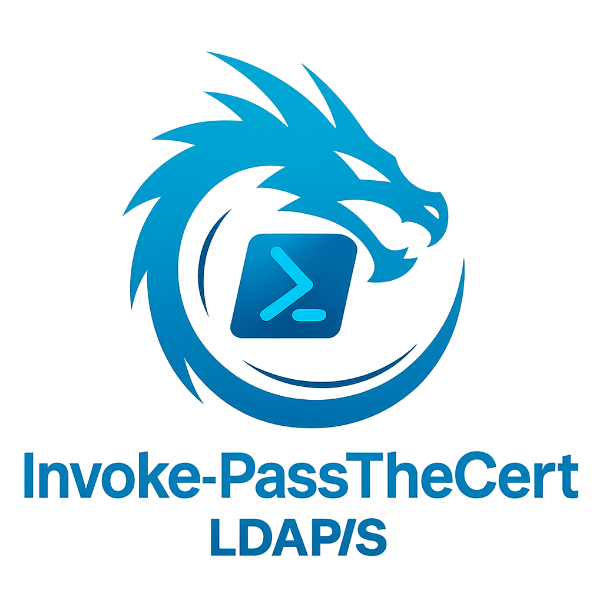

# Invoke-PassTheCert


<div align="center">

</div>

## Description

Invoke-PassTheCert is a pure PowerShell port of PassTheCert. The purpose of this repository is to expand the landscape of PowerShell tooling available to Penetration testers and red teamers. 

The original work by AlmondOffsec can be found here: https://github.com/AlmondOffSec/PassTheCert along with the accompanying blog post: https://offsec.almond.consulting/authenticating-with-certificates-when-pkinit-is-not-supported.html

Sometimes, Domain Controllers do not support PKINIT. This can be because their certificates do not have the Smart Card Logon EKU. However, several protocols, including LDAP, support Schannel, thus authentication through TLS.

## Changelog

This fork alters [the initial code](https://github.com/The-Viper-One/Invoke-PassTheCert/tree/24eaa20b9ac15a589f294ee4e80be345c994c90d) as follows:

- Commands can be run from a computer not joined to the domain (inspired from [the PowerView's Get-DomainSearcher](https://github.com/PowerShellMafia/PowerSploit/blob/master/Recon/PowerView.ps1#L3264-L3542)).

- Restructured code architecture and parameters for intuitive usage and easier programming (e.g. `-Action` parameter added).

- Get-Manual sections for each function added, providing detailed synopsis, syntax, parameters, examples, expected outputs, and reference links.

- Support of different types of Identity/Target, namely: `DistinguishedName`, `SID`, `GUID`, `sAMAccountName` (*not specifying a distinguishedName within `-Identity` (resp. `-Target`) implies `-IdentityDomain` (resp. `-TargetDomain`) becomes required*).

- Added multiple LDAP Building Blocks functions (i.e. core LDAP functions upon which extra features could be implemented). These functions may *easily* be exported (especially the Helpers ones) as standalones in other projects.

- Usage of LDAP Paging Control to avoid [`The size limit was exceeded` errors](https://www.openldap.org/doc/admin26/limits.html).

- Added Shadow Credentials Enumeration and Exploitation.

- Added a `_TODO` function to build a custom action.


## Pre-requisite - GetTh4'Cert

Provide a certificate allowed to authenticate against an LDAP/S Server. 

Otherwise, assuming a compromised user (resp. computer) has `Enrollment Rights` over the `User` (resp. `Computer`) certificate template (itself supporting the [`Client Authentication`](https://www.rfc-editor.org/rfc/rfc3280.html#section-4.2.1.13) [Extended Key Usage](https://learn.microsoft.com/fr-fr/openspecs/windows_protocols/ms-wcce/7785d392-44ce-44a2-b798-0eee3a129ebb)), we may request a certificate as follows.

### From Linux (certipy)

Using [`certipy-ad`](https://github.com/ly4k/Certipy/tree/c1d84d7ee752e574d2e90e79a5088961bf8f7567):

```powershell
$ sudo apt install -y certipy-ad
$ certipy-ad find -u '<user>@<domain>' -p '<password>' -enabled -stdout [-ns <dns_ip>] [-dc-ip <dc_ip>]
$ certipy-ad req -u '<user>@<domain>' -p '<password>' -target '<dc_fqdn>' -ca '<ca_name>' -template 'User' [-ns <dns_ip>] [-dc-ip <dc_ip>] [-dc-host '<dc_host>']
```

### From Windows (certreq)

Using [`certreq`](https://github.com/GhostPack/Certify/issues/13#issuecomment-3622538862)

#### Run a PowerShell Prompt as a domain user

```powershell
PS > runas /netonly /user:<domain>\<user> powershell.exe
```

#### Open the MMC, Add the `Certificates` Snap-in, and connect to a domain's computer

> If the  network interface of the domain's computer has the `File and Printer Sharing for Microsoft Networks` item unchecked, the MMC won't be able to connect to the domain, erroring-out `The domain ADLAB.LOCAL could not be found because: The RPC server is unavailable`.

> This step is optional if the CA Issuer's certificate has already been trusted locally (e.g. installed into your local Microsoft Certificate Store).

```
PS (runas) > mmc.exe /server:<dc_ip>
GUI > CTRL+M (i.e. File > Add/Remove Snap-in) > Certificates > Computer Account > Another computer > DC02 > Check Names
GUI > Certificates (\\DC02) > \\DC02\Personal > Find Certificates...
    Find in: \\DC02\Personal
    Contains: -
    ADLAB-DC02-CA > Export > DER encoded binary X.509 (.CER)
    ADLAB-DC02-CA.cer > Install Certificate... > Current User & Local Machine > Automatically select the certificate store based on the type of certificate
```

#### Based on the provided `*.inf` file, request a certificate in the PowerShell session running as the domain user (e.g. `Administrator`)

```powershell
PS (runas) > certreq -f -new Administrator.inf Administrator.req
    Template not found.  Do you wish to continue anyway?
    User
    CertReq: Request Created
```

```powershell
PS (runas) > certreq -f -submit -config "192.168.56.202\ADLAB-DC02-CA" Administrator.req Administrator.cer
    RequestId: 20
    RequestId: "20"
    Certificate retrieved(Issued) Issued  0x80094004, The Enrollee (CN=Administrator,CN=Users,DC=ADLAB,DC=LOCAL) has no E-Mail name registered in the Active Directory.  The E-Mail name will not be included in the certificate.
```

#### Install the requested certificate into the Microsoft Certificate Store

```powershell
PS (runas) > certreq -f -accept -user -config "192.168.56.202\ADLAB-DC02-CA" Administrator.rsp
    Installed Certificate:
        Serial Number: 4d0000001c61b4cb31ef3c819a00000000001c
        Subject: CN=Administrator, CN=Users, DC=ADLAB,DC=LOCAL (Other Name:Principal Name=Administrator@ADLAB.LOCAL)
        NotBefore: <DATE>
        NotAfter: <DATE>
        Thumbprint: 0e58848b07cf3b3b408ba2f57400ac5aae5f74d0
```

#### Make sure the newly installed certificate has an exportable private key

```powershell
PS > Get-ChildItem Cert:\CurrentUser\My | Where-Object { $_.HasPrivateKey }
[...]
0E58848B07CF3B3B408BA2F57400AC5AAE5F74D0  CN=Administrator, CN=Users, DC=ADLAB, DC=LOCAL
```

#### Export the requested certificate into PFX format using [`Export-PfxCertificate`](https://learn.microsoft.com/en-us/powershell/module/pki/export-pfxcertificate)

```powershell
PS > Export-PfxCertificate -Cert (Get-ChildItem Cert:\CurrentUser\My\0E58848B07CF3B3B408BA2F57400AC5AAE5F74D0) -FilePath 'Administrator.pfx' -Password (New-Object System.Security.SecureString)
```

> Here, both (i.e. either from Linux, or Windows) exported certificates are passwordless.


## Usage - PassTh4'Cert

Now, we may grab an LDAP Connection Instance, authenticating against an LDAP/S Server (e.g. `192.168.56.202:636`):

```powershell
PS > Import-Module .\Invoke-PassTheCert.ps1
PS > $LdapConnection = Invoke-PassTheCert-GetLDAPConnectionInstance -Server '192.168.56.202' -Port 636 -Certificate 'Administrator.pfx'
```

> As a side note, we may even export that LDAP/S Connection Instance into a passwordless/password-protected certificate file; for instance:

```powershell
PS > Import-Module .\Invoke-PassTheCert.ps1
PS > Get-Help Invoke-PassTheCert-ExportLDAPConnectionInstanceToFile -Full
PS > Invoke-PassTheCert-ExportLDAPConnectionInstanceToFile -LdapConnection $LdapConnection -ExportPath '.\Certified.pfx' -ExportContentType 'pfx'
PS > Invoke-PassTheCert-ExportLDAPConnectionInstanceToFile -LdapConnection $LdapConnection -ExportPath '.\Certified.p12' -ExportContentType 'pkcs12' -ExportPassword 'ExP0rTP@sssw0Rd123!'
```

Last, but definitely not least, Read The Funny Manual !

```powershell
PS > pwsh
PS > Import-Module .\Invoke-PassTheCert.ps1
PS > .\Invoke-PassTheCert.ps1 -?
```

> Each function's Get-Help documentation (helpers excluded) is partially shown below.

```bash
$ grep -A10 -P '^\s*function.*' Invoke-PassTheCert.ps1 |grep -vP '^(\s*|\s*<#\s*|\s+\.[A-Z]+.*|\s+(\[.*?\]|_.*)\s*)$' |sed 's/function _\?\(.*\)[[:space:]]*{/\1:/;s/^\s\+/    /' |xsel -b
```

```
LDAPExtendedOperationWhoami :
    Returns the Response of the "Who am I" LDAP Extended Operation (whoamiOID OBJECT IDENTIFIER ::= "1.3.6.1.4.1.4203.1.11.3") using an LDAP Connection Instance.
--
LDAPExtendedOperationPasswordModify :
    Executes the "Password Modify" LDAP Extended Operation (passwdModifyOID OBJECT IDENTIFIER ::= "1.3.6.1.4.1.4203.1.11.1") using an LDAP Connection Instance.
    As a result, updates the client's password associated with the specified LDAP Connection Instance.
--
Filter :
    Returns a list of [PSCustomObject] object(s) found by the LDAP query.
    - Suffixing the command with `|fl` pipe allows to print the multi-valued attributes conveniently, i.e. separated by new lines (e.g. `serviceprincipalename`, `memberof`) (no more "...").
    - Returns $null if no entry is found.
--
CreateObject :
    Creates an LDAP object.
    - The object MUST NOT already exist.
    - (Computers) The LDAP Connection Instance's account MUST NOT have already created an MAQ (ms-DS-MachineAccountQuota) number of computers (defaults to 10 maximum per account).
    - (Users/Computers) The `sAMAccountName` MUST be UNIQUE.
--
DeleteObject :
    Deletes a specified object.
    - The object to be deleted MUST exist.
--
GetInboundACEs :
    Returns all inbound ACEs over a targeted specified object.
    - You may manually check any `PrincipalTo*.txt` file, to get a glance of possible ACEs.
--
CreateInboundACE :
    Creates an inbound ACE for a principal into a targeted object. In other words, it grants/denies an ACE to the principal (source) over the targeted object (destination)
    - You may manually check any `PrincipalTo*.txt` file, to get a glance of possible ACEs.
    - The inbound ACE to create MUST NOT already exist in the target's inbound ACEs (i.e. in its `nTSecurityDescriptor`).
--
DeleteInboundACE :
    Deletes an inbound ACE for a principal into a targeted object. In other words, it deletes an ACE granted/denied to the principal (source) over the targeted object (destination)
    - You may manually check any `PrincipalTo*.txt` file, to get a glance of possible ACEs.
    - The inbound ACE to delete MUST already exist in the target's inbound ACEs (i.e. in its 'nTSecurityDescriptor').
--
GetInboundSDDLs :
    Returns the SDDL String of all the inbound ACEs applied against a specified targeted object.
--
CreateInboundSDDL :
    Creates an inbound SDDL (Security Descriptor Definition Language) for a principal into a targeted object's attribute. In other words, it grants/denies an SDDL to the principal (source) over the attribute of a targeted object (destination).
    - You may check the `DeepDiveIntoACEsAndSDDLs` to get a glance of the SDDL format.
--
UpdatePasswordOfIdentity :
    Updates the password of the specified identity.
--
OverwriteValueInAttribute :
    Replaces the value(s) from an existing attribute on a targeted object.
    - This function overwrites ALL existing values of the specified attribute with the provided value.
    - For instance, if the `description` attribute was set to `Whoami1?!`, overwritting it with value `Whoami2?!` would set its content to `Whoami2?!`.
--
AddValueInAttribute :
    Adds a specified value to an existing attribute on a targeted object.
    - The attribute's value must be undefined, or empty. Otherwise, the attribute must be multi-valued (e.g. `serviceprincipalname`).
--
RemoveValueInAttribute :
    Removes a specified value from an existing attribute on a targeted object.
    - The attribute must have been set to (or contain, if the attribute is multi-valued, e.g. `serviceprincipalname`) the specified value.
--
ClearAttribute :
    Clears the value(s) of a specified attribute on a targeted object.
    - The attribute MUST exist (i.e. filled with at least one non-empty value).
--
ShowStatusOfAccount :
    Returns the text of the specified account's status (i.e. 'Enabled', or 'Disabled').
--
EnableAccount :
    Enables a specified account.
--
DisableAccount :
    Disables a specified account.
--
AddGroupMember :
    Adds a member to a group.
    - The group MUST NOT already contain the specified member.
--
RemoveGroupMember :
    Removes a member from a group.
    - The group MUST already contain the specified member.
--
LDAPEnum :
    Invoke-PassTheCert wrapper for LDAP enumerations.
--
LDAPExploit :
    Invoke-PassTheCert wrapper for LDAP exploitation
--
TODO :
    Makin' My Own Custom Function.
    - The Custom Function MUST be implemented by YOU !
--
Invoke-PassTheCert-GetLDAPConnectionInstance :
    Returns an object containing the LDAP Connection Instance upon after certificate-authenticating to an LDAP/S Server.
--
Invoke-PassTheCert-ExportLDAPConnectionInstanceToFile :
    Exports an LDAP Connection Instance to a certificate file
--
Invoke-PassTheCert :
    Main function to perform various LDAP Operations after using an established LDAP Connection Instance to an LDAP/S Server through Schannel authentication with a certificate.
```


## TODOs

- Support for Start TLS.
- `GetInboundACEs`: Investigate why translating the SID to a `sAMAccountName` makes the execution extremely slower.
- `CreateObject`: Implement creation of objects other than `User` or `Computer`.
- `LDAPEnum`: Implement more LDAP enumerations.
- `LDAPExploit`: Implement more LDAP attacks (LDAP interactive Shell, etc.).
- `LDAPExploit:ShadowCreds`: Check whether not specifying [`CustomKeyInfo` and `LastLogonTime`](https://github.com/MichaelGrafnetter/DSInternals/blob/6fe15cab429f51d91e8b281817fa23b13804456c/Src/DSInternals.Common/Data/Hello/KeyCredential.cs#L459-L475) in `msDS-KeyCredentialLink` is *always* fine (i.e. we still can authenticate with the populated certificate entry).
- `LDAPExtendedOperationPasswordModify`: Implement the `Password Modify` LDAP Extended Operation. *Alternatively, `UpdatePasswordOfIdentity` can be used, where the identity is the LDAP Connection Instance's account.*
